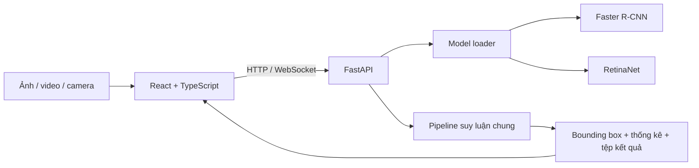

# KẾ HOẠCH TRIỂN KHAI DEMO REACT + FASTAPI

## 1. Thông tin kiểm soát

- **Đề tài:** Ứng dụng và so sánh Faster R-CNN và RetinaNet trong phát hiện người điều khiển xe máy không đội mũ bảo hiểm từ hình ảnh giao thông.
- **Người phụ trách:** Nguyễn Thành Long.
- **Trạng thái:** Đã được Long duyệt hướng giao diện React + FastAPI ngày 27/08/2026.
- **Phạm vi:** Ứng dụng cục bộ xử lý ảnh, video và camera; hiển thị bounding box, nhãn, confidence, thống kê và thời gian suy luận quan sát được.
- **Không thuộc phạm vi bắt buộc:** triển khai Internet, đăng nhập, lưu lịch sử trên cơ sở dữ liệu, theo dõi đối tượng, nhận dạng biển số, ONNX/TensorRT.

## 2. Quyết định kiến trúc



- Frontend: React, TypeScript, Vite và Material UI.
- Backend: FastAPI, PyTorch/Torchvision và pipeline hiện có trong `src/`.
- React không nạp hoặc chạy checkpoint. Mọi suy luận vẫn thực hiện trong Python.
- Ứng dụng ưu tiên chạy cục bộ để dùng GPU RTX 2050 và checkpoint trên máy.
- Chỉ nạp một mô hình trên GPU tại một thời điểm để hạn chế hết VRAM.

## 3. Dữ liệu và artifact đã chốt

- Lớp phát hiện: `BikeWithRider`, `NoHelmet`, `Helmet`.
- Faster R-CNN: `outputs/faster_rcnn/checkpoints/best_map.pth`.
- RetinaNet: `outputs/retinanet/checkpoints/best_map.pth`.
- Threshold validation mặc định:
  - Faster R-CNN: `0,85`.
  - RetinaNet: `0,60`.
- Nguồn threshold: `configs/demo_thresholds.yaml`.
- Không sử dụng tập test để chọn threshold hoặc điều chỉnh giao diện demo.

## 4. Thiết kế giao diện “AI Vision Studio”

### 4.1. Bố cục desktop

```text
┌──────────────────────────────────────────────────────────────────┐
│ Helmet Detection AI       GPU/CPU • Trạng thái mô hình           │
├──────────────────────────────────────────────────────────────────┤
│                 Ảnh      Video      Camera                       │
├────────────────────────────────────────┬─────────────────────────┤
│                                        │ CẤU HÌNH SUY LUẬN       │
│  Vùng kéo thả / ảnh-video kết quả      │ Chọn mô hình            │
│  Chiếm khoảng 2/3 chiều rộng           │ Threshold + nhãn mặc định│
│                                        │ Nút phát hiện            │
├────────────────────────────────────────┴─────────────────────────┤
│ Tổng đối tượng │ Không mũ │ Có mũ │ Xe/người lái │ latency/FPS   │
├──────────────────────────────────────────────────────────────────┤
│ Bảng detection: lớp | confidence | tọa độ bounding box           │
└──────────────────────────────────────────────────────────────────┘
```

### 4.2. Hệ thống hình ảnh

- Nền ứng dụng: `#F6F8FB`; thẻ trắng; chữ chính xanh đen.
- Màu mô hình: Faster R-CNN xanh dương; RetinaNet tím.
- Màu lớp cố định: `NoHelmet` đỏ, `Helmet` xanh lá, `BikeWithRider` xanh lam.
- Font: Inter hoặc font sans-serif hệ thống.
- Khoảng cách theo lưới 8 px; thẻ bo góc 12–16 px; đổ bóng nhẹ.
- Không dùng biểu đồ hoặc số liệu giả để trang trí.
- Desktop dùng lưới 8/4; màn hình nhỏ đưa bảng điều khiển xuống dưới.

### 4.3. Trạng thái giao diện bắt buộc

- Chưa chọn tệp.
- Đang tải mô hình.
- Đang suy luận.
- Thành công và không có detection sau threshold.
- Thành công và có detection.
- Tệp sai định dạng hoặc quá dung lượng.
- Thiếu checkpoint/hash không khớp.
- CUDA không khả dụng và chuyển sang CPU.
- Xử lý video có phần trăm tiến độ và khả năng tải kết quả.

## 5. Cấu trúc mã nguồn dự kiến

```text
helmet_detection_project/
├── frontend/
│   ├── src/
│   │   ├── components/
│   │   ├── features/detection/
│   │   ├── services/api.ts
│   │   ├── theme.ts
│   │   └── App.tsx
│   └── package.json
├── app/
│   ├── api.py
│   ├── model_loader.py
│   └── schemas.py
├── src/
│   └── infer.py
└── configs/demo_thresholds.yaml
```

## 6. Hợp đồng API dự kiến

- `GET /api/health`: trạng thái backend, CUDA và thiết bị.
- `GET /api/models`: danh sách mô hình, checkpoint và threshold validation mặc định.
- `POST /api/infer/image`: nhận ảnh, model và threshold; trả metadata và ảnh kết quả.
- `POST /api/infer/video`: tạo tác vụ xử lý video; trả `job_id`.
- `GET /api/jobs/{job_id}`: trả trạng thái, tiến độ và đường dẫn kết quả video.
- `POST /api/infer/frame`: nhận ảnh chụp/frame camera và trả kết quả.

Các phản hồi lỗi phải có `code`, `message` và chi tiết có thể hiển thị cho người dùng. Không gửi stack trace Python ra giao diện.

## 7. Thứ tự triển khai

### Giai đoạn 1 — Giao diện tĩnh có thể duyệt — ĐÃ HOÀN THÀNH

- Khởi tạo React + TypeScript.
- Dựng header, tab ảnh/video/camera, vùng media, bảng cấu hình và thẻ thống kê.
- Dùng dữ liệu minh họa có nhãn rõ là `Bản xem trước giao diện`, không trình bày như kết quả mô hình.
- Kiểm tra build và bố cục desktop trước khi nối backend.

### Giai đoạn 2 — Pipeline suy luận và model loader — ĐÃ HOÀN THÀNH

- Hoàn thiện `src/infer.py`.
- Hoàn thiện `app/model_loader.py` với strict checkpoint load và kiểm tra SHA-256.
- Dùng một pipeline tiền xử lý, lọc prediction và vẽ box cho cả hai mô hình.
- Viết unit test cho threshold, schema, class mapping và ảnh RGB/grayscale/RGBA.

### Giai đoạn 3 — FastAPI và demo ảnh — ĐÃ HOÀN THÀNH

- Xây endpoint health, models và infer image.
- Nối frontend với ảnh upload/camera snapshot.
- Hiển thị ảnh gốc, ảnh kết quả, số detection từng lớp và latency quan sát.
- Cho tải ảnh kết quả.

### Giai đoạn 4 — Video và camera — CHƯA TRIỂN KHAI

- Video xử lý tuần tự, batch size 1; không giữ toàn bộ frame trong RAM.
- Hiển thị tiến độ bằng polling hoặc WebSocket.
- Camera dùng API trình duyệt, gửi snapshot/frame có kiểm soát sang backend.
- Không khẳng định xử lý thời gian thực nếu chưa có FPS đáp ứng tiêu chí đã định nghĩa.

### Giai đoạn 5 — QA và bàn giao — ĐANG THỰC HIỆN

- Chạy unit/integration test và frontend build.
- Kiểm tra cả Faster R-CNN và RetinaNet trên cùng ảnh đầu vào.
- Kiểm tra tệp hỏng, không có detection, CUDA lỗi và chuyển model liên tiếp.
- Chụp giao diện, dự đoán đúng, bỏ sót, phát hiện nhầm và cảnh khó cho báo cáo.
- Cập nhật README và phụ lục hướng dẫn chạy.

## 8. Tiêu chí nghiệm thu

- [ ] Frontend React build thành công và hiển thị tốt trên desktop.
- [ ] Ba chế độ ảnh, video và camera có trạng thái rõ ràng.
- [ ] Backend FastAPI dùng đúng pipeline PyTorch/Torchvision.
- [ ] Hai checkpoint được nạp strict và kiểm tra hash.
- [ ] Threshold mặc định lấy từ validation: Faster R-CNN `0,85`, RetinaNet `0,60`.
- [ ] Người dùng có thể chỉnh threshold nhưng giao diện ghi rõ đây chỉ là ngưỡng hiển thị demo.
- [ ] Bounding box, nhãn, confidence và màu lớp đúng.
- [ ] Latency/FPS ghi rõ điều kiện đo và không thay thế benchmark chính thức.
- [ ] Không đọc test hoặc điều chỉnh theo test trong demo.
- [ ] Có ảnh chụp và ví dụ định tính phục vụ báo cáo.

## 9. Lệnh chạy mục tiêu

```powershell
# Backend
.venv\Scripts\python.exe -m uvicorn app.api:app --reload --port 8000

# Frontend
Set-Location frontend
npm run dev

# Kiểm thử
.venv\Scripts\python.exe -m pytest -q
npm run build
```

## 10. Rủi ro chính

| Rủi ro | Phương án xử lý |
|---|---|
| GPU hết VRAM khi đổi model | Chỉ giữ một model trên GPU; giải phóng model cũ trước khi nạp model mới |
| Camera gửi quá nhiều frame | Giới hạn tần suất gửi; ưu tiên snapshot trong bản bắt buộc |
| Video dài làm treo request | Chạy tác vụ nền, trả `job_id` và cập nhật tiến độ |
| Frontend hiển thị số liệu mẫu như kết quả thật | Gắn nhãn rõ `Bản xem trước`; thay toàn bộ bằng phản hồi API khi tích hợp |
| CORS giữa hai cổng local | Chỉ cho phép origin frontend local đã cấu hình |
| Codec video không tương thích | Cung cấp tệp tải xuống và codec dự phòng có ghi chú |

Kế hoạch này thay thế kế hoạch Streamlit trước đó. Cổng duyệt tiếp theo là **giao diện React tĩnh**, sau đó mới nối FastAPI và mô hình.
