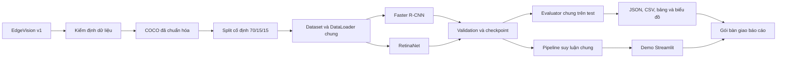

# KẾ HOẠCH XÂY DỰNG HỆ THỐNG PHÁT HIỆN KHÔNG ĐỘI MŨ BẢO HIỂM

## 0. Thông tin kiểm soát kế hoạch

- **Đề tài:** Ứng dụng và so sánh mô hình Faster R-CNN và RetinaNet trong phát hiện người điều khiển xe máy không đội mũ bảo hiểm từ hình ảnh giao thông.
- **Người yêu cầu lập kế hoạch:** Nguyễn Thành Long.
- **Trạng thái:** Đã được Nguyễn Thành Long duyệt ngày 25/08/2026.
- **Ngày lập kế hoạch:** 25/08/2026.
- **Hạn hoàn thành kỹ thuật:** trước ngày **03/09/2026**, tương đương chậm nhất 23:59 ngày **02/09/2026**.
- **Mốc bàn giao cho nhóm viết báo cáo:** từ ngày **03/09/2026**.
- **Phạm vi của tệp:** thiết kế hệ thống, quy trình thực hiện, đầu ra, kiểm thử, tiêu chí nghiệm thu và lịch triển khai.
- **Chưa thuộc phạm vi của tệp:** phân chia tên thành viên, tạo GitHub Issues và giao việc. Các nội dung này chỉ được thực hiện sau khi Long duyệt kế hoạch.

## 1. Hiện trạng dự án

Kho mã hiện mới là scaffold ban đầu:

- Đã có cấu trúc `configs/`, `data/`, `src/`, `tools/`, `app/`, `outputs/`, `report/` và `tests/`.
- Đã có lớp đọc COCO tối giản, biến đổi ảnh cơ bản và hàm tạo Faster R-CNN/RetinaNet.
- `src/train.py`, `src/evaluate.py`, `src/infer.py`, `src/compare_models.py`, benchmark và ứng dụng demo vẫn là khung, chưa xử lý xuyên suốt.
- Chưa tải dataset, chưa tạo split và chưa có thống kê dữ liệu đã xác minh.
- Máy Long chưa có Python trong `PATH` của hệ thống.
- GPU đã xác minh: NVIDIA GeForce RTX 2050, VRAM 4.096 MiB; RAM máy 16 GB.
- Chưa có checkpoint, training log, metric, bảng so sánh hoặc kết quả demo.
- Kho Git đang ở nhánh `main`, đồng bộ với GitHub tại commit `696ca2a`.

Do hạn kỹ thuật là 02/09/2026, dự án chỉ thực hiện một baseline có kiểm soát cho mỗi mô hình. Không mở rộng sang tìm kiếm hyperparameter quy mô lớn.

## 2. Mục tiêu và điều kiện hoàn thành

### 2.1. Mục tiêu tổng quát

Xây dựng một pipeline thống nhất để:

1. Tiếp nhận và kiểm định dữ liệu EdgeVision.
2. Tạo duy nhất một cách chia train/validation/test được cố định bằng hash.
3. Fine-tune Faster R-CNN và RetinaNet trên cùng dữ liệu và giao thức.
4. Chọn checkpoint bằng validation, không sử dụng test để điều chỉnh.
5. Đánh giá hai mô hình bằng cùng evaluator.
6. So sánh độ chính xác, khả năng phát hiện lớp `NoHelmet`, tốc độ và tài nguyên.
7. Tích hợp hai checkpoint vào ứng dụng Streamlit.
8. Bàn giao đủ artifact có thể kiểm chứng để nhóm viết báo cáo từ ngày 03/09/2026.

### 2.2. Điều kiện được coi là hoàn thành kỹ thuật

Đến hết ngày 02/09/2026 phải có tối thiểu:

- Một split manifest cố định và thống kê dữ liệu đã kiểm tra.
- Một checkpoint hợp lệ của Faster R-CNN.
- Một checkpoint hợp lệ của RetinaNet.
- Cấu hình, môi trường, Git commit và dataset hash của từng lần chạy.
- Validation metric và test metric do chương trình xuất tự động.
- Bảng so sánh gồm mAP, AP theo lớp, Precision/Recall của `NoHelmet`, latency/FPS và peak VRAM.
- Một bộ ảnh dự đoán đúng, dự đoán sai và trường hợp khó để phân tích.
- Demo Streamlit chạy được với ảnh, video và ảnh chụp camera.
- Hướng dẫn chạy và gói bàn giao phục vụ báo cáo.

Không đặt trước ngưỡng mAP tối thiểu vì chưa có baseline thực nghiệm. “Hoàn thành” được hiểu là pipeline đúng, đánh giá công bằng và kết quả có nguồn gốc rõ ràng; không đồng nghĩa với tự tạo hoặc ép số liệu đạt một mức chưa được kiểm chứng.

## 3. Các quyết định kỹ thuật đã chốt

| Hạng mục | Quyết định |
|---|---|
| Dataset | EdgeVision Dataset, phiên bản 1 |
| Định dạng | COCO JSON |
| Lớp | `BikeWithRider`, `NoHelmet`, `Helmet` |
| Mục tiêu nghiệp vụ | Train đủ ba lớp, ưu tiên phân tích `NoHelmet` |
| Mô hình | Faster R-CNN ResNet-50 FPN v2 và RetinaNet ResNet-50 FPN v2 |
| Framework | PyTorch/Torchvision |
| Nơi kiểm thử | Máy Long, RTX 2050 4 GB |
| Nơi train chính thức | Kaggle GPU; hai mô hình chạy tuần tự |
| Tỷ lệ split | 70% train, 15% validation, 15% test |
| Random seed | 42 |
| Metric chính chọn checkpoint | Validation mAP@0.5:0.95 |
| Metric báo cáo | mAP@0.5:0.95, mAP@0.5, AP từng lớp, Precision/Recall `NoHelmet`, latency/FPS |
| Demo | Streamlit: ảnh, video, camera snapshot |
| Ngân sách thử nghiệm | Một baseline/mô hình; một cửa sổ sửa lỗi chung vào 31/08 |

Theo trang công bố chính thức, EdgeVision v1 có 2.392 ảnh, 8.275 bounding box, ba lớp nêu trên, ba định dạng annotation và giấy phép CC BY 4.0. Các con số này phải được kiểm tra lại từ tệp tải thực tế trước khi ghi vào báo cáo.

- Nguồn dataset: <https://data.mendeley.com/datasets/j82bnw7gsr/1>
- DOI: `10.17632/j82bnw7gsr.1`

## 4. Kiến trúc tổng thể



### 4.1. Nguyên tắc kiến trúc

- Chỉ tồn tại một nguồn cấu hình chung cho dữ liệu, seed, kích thước ảnh và đánh giá.
- Hai mô hình có tệp cấu hình riêng nhưng chỉ chứa khác biệt thật sự cần thiết.
- Dataset và evaluator không được viết riêng cho từng mô hình.
- Pipeline huấn luyện và suy luận không được sao chép vào Kaggle Notebook; notebook chỉ gọi các lệnh trong `src/`.
- Dữ liệu gốc, checkpoint và video lớn không đưa vào Git.
- Metric, cấu hình và manifest nhỏ phải có thể lưu cùng mã nguồn để nhóm kiểm chứng.
- Mỗi số trong báo cáo phải truy ngược được đến một `run_id` và tệp metric cụ thể.

## 5. Hợp đồng dữ liệu và nhãn

### 5.1. Ánh xạ lớp chuẩn

| ID nội bộ | Tên lớp | Ý nghĩa sử dụng |
|---:|---|---|
| 0 | `background` | Nền; không phải annotation thật |
| 1 | `BikeWithRider` | Khung xe máy kèm người điều khiển/ngồi trên xe |
| 2 | `NoHelmet` | Đối tượng không đội mũ; lớp nghiệp vụ chính |
| 3 | `Helmet` | Đối tượng đội mũ |

Quy tắc:

- COCO `category_id` phải đúng 1, 2, 3 sau khi kiểm tra.
- Cả hai model dùng `num_classes=4`, bao gồm nền.
- Không đổi ID khác nhau giữa train, evaluate và demo.
- Nếu annotation tải về khác mapping công bố, pipeline phải dừng thay vì tự suy đoán.

### 5.2. Target đầu vào

Mỗi ảnh trả về:

```text
image: Tensor float32 [3, H, W], miền giá trị [0, 1]
target.boxes: Tensor float32 [N, 4], định dạng xyxy
target.labels: Tensor int64 [N], giá trị 1..3
target.image_id: Tensor int64
target.area: Tensor float32 [N]
target.iscrowd: Tensor int64 [N]
```

### 5.3. Prediction đầu ra

```text
prediction.boxes: Tensor float32 [M, 4], định dạng xyxy
prediction.labels: Tensor int64 [M]
prediction.scores: Tensor float32 [M]
```

### 5.4. Giới hạn về quan hệ người–xe–mũ

Phiên bản này không tạo quan hệ định danh giữa box `NoHelmet`/`Helmet` với box `BikeWithRider`. Dataset công bố bounding box theo lớp nhưng chưa xác minh có ID liên kết giữa các đối tượng. Demo vì vậy phát hiện ba loại đối tượng và làm nổi bật `NoHelmet`; không khẳng định một box đầu cụ thể thuộc về một xe cụ thể trong cảnh đông người.

## 6. Quy trình dữ liệu

### 6.1. Tiếp nhận dữ liệu

1. Tải đúng EdgeVision phiên bản 1 từ trang Mendeley.
2. Ghi ngày tải, DOI, giấy phép, tên tệp và checksum SHA-256.
3. Lưu bản gốc trong `data/raw/edgevision/`.
4. Không chỉnh sửa, đổi tên hàng loạt hoặc xóa tệp trong `data/raw/`.
5. Mọi sửa lỗi annotation phải tạo bản processed mới và có log.

### 6.2. Kiểm định bắt buộc

Công cụ kiểm định phải phát hiện và thống kê:

- Ảnh được khai báo nhưng không tồn tại.
- Ảnh không đọc được hoặc sai định dạng.
- Trùng `image_id`, `annotation_id` hoặc tên tệp.
- Category ngoài tập 1–3.
- Bounding box không đủ bốn giá trị.
- Width/height không dương.
- Box vượt ngoài kích thước ảnh.
- Annotation tham chiếu tới ảnh không tồn tại.
- Ảnh không có annotation.
- Số ảnh, số box và phân bố từng lớp.
- Phân bố chiều rộng, chiều cao và diện tích box.

Phải xem trực quan tối thiểu 30 annotation mỗi lớp để xác nhận box bao quanh đối tượng nào. Nếu ý nghĩa lớp khác mô tả dự kiến, dừng trước khi train và cập nhật kế hoạch.

### 6.3. Chính sách xử lý lỗi

- Ảnh thiếu/hỏng, ID trùng hoặc category không hợp lệ: lỗi chặn pipeline.
- Box có width/height không dương: loại khỏi bản processed và ghi ID vào báo cáo lỗi.
- Box lệch nhẹ khỏi biên do làm tròn: clip về biên ảnh và ghi log.
- Box lệch lớn hoặc sai ngữ nghĩa: đưa vào danh sách cần kiểm tra, không tự sửa.
- Không xóa lỗi khỏi báo cáo kiểm định sau khi xử lý; phải lưu trạng thái trước và sau.

### 6.4. Chống rò rỉ và tạo split

1. Tính SHA-256 để phát hiện ảnh giống hệt.
2. Tính perceptual hash để phát hiện ảnh gần trùng.
3. Đưa ảnh trùng/gần trùng vào cùng một nhóm.
4. Nếu tên tệp thể hiện chuỗi frame/cảnh, các frame cùng cảnh phải cùng nhóm.
5. Chia theo nhóm với seed 42, không chia ngẫu nhiên từng ảnh độc lập.
6. Cân bằng tương đối số ảnh và số annotation từng lớp giữa ba split.
7. Lưu `train_ids`, `val_ids`, `test_ids`, thống kê và hash.
8. Kiểm tra không có ID hoặc nhóm trùng giữa các split.
9. Sau smoke test, đóng băng split; không tạo lại vì kết quả chưa tốt.

## 7. Môi trường và hạ tầng

### 7.1. Máy Long

Vai trò:

- Cài môi trường và kiểm tra code.
- Chạy unit test và smoke test ngắn.
- Chạy inference, benchmark cuối và demo.
- Không ưu tiên full training nếu Kaggle hoạt động bình thường.

Môi trường phải ghi:

- Phiên bản Windows, Python, PyTorch và Torchvision.
- CUDA runtime mà PyTorch sử dụng.
- NVIDIA driver.
- GPU và VRAM.
- CPU và RAM.
- Phiên bản TorchMetrics, pycocotools, OpenCV và Streamlit.

### 7.2. Kaggle

- Dùng một GPU tại một thời điểm.
- Ghi chính xác GPU bằng `nvidia-smi` trước mỗi lần train.
- Chỉ chấp nhận hai lần train chính thức khi cùng loại GPU.
- Cài cùng phiên bản thư viện đã khóa cho cả hai model.
- Notebook chỉ nhận `model_name`, `config`, `run_id` và tùy chọn resume.
- Lưu `best.pth` mỗi khi validation mAP cải thiện.
- Lưu `last.pth` mỗi epoch để phục hồi khi phiên bị ngắt.
- Không ghi GitHub token vào notebook; nếu cần, dùng Kaggle Secret với quyền đọc tối thiểu.

### 7.3. Phương án dự phòng hạ tầng

- Nếu Kaggle ngắt phiên: tiếp tục từ `last.pth`, không train lại từ đầu.
- Nếu đến 18:00 ngày 28/08 vẫn không có Kaggle GPU ổn định: chuyển cả hai lần train chính thức về RTX 2050 với cùng cấu hình giảm bộ nhớ.
- Không được train một model trên Kaggle và model còn lại trên RTX 2050 rồi dùng thời gian train để so sánh.
- Benchmark inference cuối luôn chạy cả hai model trên RTX 2050 của Long.

## 8. Cấu hình baseline

| Tham số | Giá trị ban đầu |
|---|---|
| Model | Faster R-CNN v2 / RetinaNet v2 |
| Backbone | ResNet-50 FPN |
| Khởi tạo | Trọng số pretrained COCO |
| Trainable backbone layers | 3 |
| `min_size` | 512 |
| `max_size` | 768 |
| Augmentation | Horizontal flip, xác suất 0,5 |
| Epoch tối đa | 20 |
| Effective batch size | 2 |
| Optimizer | SGD |
| Learning rate | 0,0025 |
| Momentum | 0,9 |
| Weight decay | 0,0005 |
| Scheduler | StepLR, step size 7, gamma 0,1 |
| Mixed precision | Bật khi dùng CUDA |
| Validation | Mỗi epoch |
| Metric chọn checkpoint | mAP@0.5:0.95 |
| Early stopping | Tối thiểu 8 epoch, patience 5, min delta 0,001 |
| Seed | 42 |

Tài liệu chính thức:

- Faster R-CNN v2: <https://docs.pytorch.org/vision/stable/models/generated/torchvision.models.detection.fasterrcnn_resnet50_fpn_v2.html>
- RetinaNet v2: <https://docs.pytorch.org/vision/stable/models/generated/torchvision.models.detection.retinanet_resnet50_fpn_v2.html>

### 8.1. Quy tắc khi thiếu VRAM

1. Không train hai model đồng thời.
2. Thử batch size 2 trên Kaggle.
3. Nếu OOM, dùng batch size 1 và gradient accumulation 2 cho **cả hai** model.
4. Nếu vẫn OOM, dùng chung `min_size=448`, `max_size=672`.
5. Mọi thay đổi phải ghi vào config và experiment manifest.
6. Không giảm kích thước riêng một model rồi so sánh trực tiếp mà không giải thích.

### 8.2. Chính sách lần chạy bổ sung

Do hạn 02/09, chỉ có một cửa sổ sửa lỗi chung vào ngày 31/08:

- Ưu tiên chạy lại model bị lỗi, OOM, loss không hữu hạn hoặc `NoHelmet AP=0`.
- Nếu cả hai baseline hợp lệ, không bắt buộc chạy lại chỉ để tìm số đẹp hơn.
- Chỉ thay đổi một yếu tố mỗi lần và ghi lý do dựa trên validation.
- Không xem test để quyết định sửa learning rate, ảnh, epoch hoặc threshold.
- Nếu cả hai model đều gặp lỗi, mục tiêu ưu tiên là có một lần chạy đúng cho mỗi model, không tiếp tục tìm kiếm hyperparameter.

## 9. Huấn luyện và checkpoint

### 9.1. Chu trình một epoch

1. Đọc batch ảnh và target.
2. Chuyển dữ liệu tới GPU.
3. Forward trong chế độ train.
4. Tổng hợp các thành phần loss.
5. Kiểm tra loss hữu hạn.
6. Backward bằng AMP scaler khi CUDA khả dụng.
7. Cập nhật optimizer và scheduler đúng thời điểm.
8. Ghi loss thành phần, learning rate, thời gian và peak VRAM.
9. Chạy validation bằng evaluator chung.
10. Lưu checkpoint tốt nhất khi mAP@0.5:0.95 tăng.
11. Luôn cập nhật checkpoint cuối để resume.

### 9.2. Nội dung checkpoint

```text
schema_version
run_id
model_name
model_state_dict
optimizer_state_dict
scheduler_state_dict
amp_scaler_state_dict
epoch
best_validation_metric
class_mapping
config
git_commit
dataset_hash
split_hash
environment
random_seed
```

### 9.3. Quy ước `run_id`

```text
<model>_<yyyymmdd-hhmm>_<git-short-hash>_seed42
```

Ví dụ định dạng, không phải kết quả thật:

```text
fasterrcnn_20260829-0800_abcdef1_seed42
```

## 10. Giao thức đánh giá

### 10.1. IoU

IoU đo mức chồng lấp giữa box dự đoán và box ground truth:

```text
IoU = diện tích phần giao / diện tích phần hợp
```

IoU bằng 0 khi không chồng lấp và bằng 1 khi hai box trùng hoàn toàn.

### 10.2. Ghép prediction với ground truth

- Chỉ ghép các box cùng lớp.
- Sắp xếp prediction theo confidence giảm dần.
- Một prediction là TP nếu IoU ≥ 0,5 với một ground truth chưa được ghép.
- Prediction không ghép được là FP.
- Ground truth không được ghép là FN.
- Nhiều prediction cùng khớp một ground truth: chỉ prediction đầu tiên là TP; phần còn lại là FP.

### 10.3. Precision và Recall của `NoHelmet`

```text
Precision = TP / (TP + FP)
Recall    = TP / (TP + FN)
F1        = 2 × Precision × Recall / (Precision + Recall)
```

- Chọn confidence threshold trên validation bằng F1 của `NoHelmet` cao nhất.
- Khóa threshold riêng của mỗi model sau validation.
- Áp threshold đã khóa lên test.
- Bảng kết quả phải ghi cả threshold để tránh so sánh mơ hồ.

### 10.4. AP và mAP

- Báo cáo mAP@0.5:0.95 theo chuẩn COCO làm metric chính.
- Báo cáo thêm mAP@0.5 để dễ diễn giải.
- Xuất AP riêng cho `BikeWithRider`, `NoHelmet`, `Helmet`.
- Có thể xuất mAR@100 làm thông tin phụ.
- Không lọc prediction bằng confidence cao trước khi tính mAP; evaluator cần danh sách score để dựng đường Precision–Recall.

### 10.5. Tệp metric bắt buộc

```text
map_50_95
map_50
map_per_class
mar_100
nohelmet_precision
nohelmet_recall
nohelmet_f1
nohelmet_confidence_threshold
iou_threshold
num_test_images
dataset_hash
split_hash
checkpoint_hash
evaluator_version
```

### 10.6. Quy tắc sử dụng test

- Không chạy test trong quá trình chọn epoch hoặc learning rate.
- Chỉ chạy test sau khi chốt checkpoint bằng validation.
- Nếu phát hiện bug evaluator sau khi test, phải sửa bug và chạy lại **cả hai** model bằng cùng commit; ghi sự kiện trong manifest.
- Không chỉ chạy lại model có kết quả thấp hơn.

## 11. Benchmark tốc độ và tài nguyên

- Phần cứng: RTX 2050 4 GB của Long.
- Batch size: 1.
- Cùng 100 ảnh được chọn cố định từ test; nếu test ít hơn 100 ảnh thì dùng toàn bộ.
- Warm-up: 20 lượt.
- Số lượt đo: tối thiểu 100.
- Dùng `torch.cuda.synchronize()` trước và sau vùng đo.
- Latency gồm chuyển tensor, forward và hậu xử lý/NMS.
- Không tính thời gian đọc tệp, ghi tệp, vẽ box và hiển thị giao diện.
- Báo cáo mean, median, p95 latency, FPS và peak VRAM.
- Công thức: `FPS = 1000 / latency trung bình (ms)`.
- Hai model chạy tuần tự trong cùng môi trường và cùng chế độ nguồn của laptop.
- Không dùng cụm “thời gian thực” nếu chưa định nghĩa và đạt ngưỡng phù hợp.

## 12. Pipeline suy luận và demo Streamlit

### 12.1. Chức năng

- Chọn Faster R-CNN hoặc RetinaNet.
- Hiển thị checkpoint/run ID đang dùng.
- Tải ảnh JPG/PNG.
- Tải video MP4/AVI.
- Chụp một ảnh từ camera bằng giao diện Streamlit.
- Điều chỉnh confidence threshold.
- Vẽ box, nhãn và confidence.
- Dùng màu riêng cho ba lớp; `NoHelmet` được làm nổi bật.
- Hiển thị số detection theo lớp.
- Hiển thị latency quan sát được cho từng ảnh/frame.
- Cho phép tải ảnh/video kết quả.

### 12.2. Không thuộc phiên bản bắt buộc

- Webcam live liên tục bằng WebRTC.
- Theo dõi đối tượng qua nhiều frame.
- Nhận dạng biển số.
- Ghép danh tính người–xe–mũ.
- Triển khai website công khai trên Internet.
- Tối ưu TensorRT/ONNX.

### 12.3. Xử lý lỗi

- Thiếu checkpoint: chặn suy luận và hướng dẫn vị trí cần đặt file.
- Checkpoint sai model hoặc class mapping: từ chối tải.
- File ảnh/video hỏng: báo lỗi cho người dùng, không làm ứng dụng dừng.
- CUDA không khả dụng: chuyển CPU và hiển thị cảnh báo tốc độ.
- OOM: giải phóng cache, báo lỗi rõ ràng và đề nghị đầu vào nhỏ hơn.
- Không có detection: vẫn trả ảnh gốc kèm thông báo, không coi là lỗi chương trình.

## 13. Artifact và cấu trúc bàn giao

### 13.1. Không đưa vào Git

- Dataset gốc.
- Checkpoint `.pth`, `.pt`, `.ckpt`.
- Video đầu vào/đầu ra lớn.
- Token, secret hoặc thông tin đăng nhập.
- Cache, môi trường ảo và tệp tạm.

### 13.2. Được lưu để nhóm kiểm chứng

Mỗi lần train chính thức phải bàn giao:

```text
run_manifest.json
config.yaml
environment.json
history.csv
val_metrics.json
test_metrics.json
speed_metrics.json
checkpoint_sha256.txt
predictions_test.json
error_samples/
```

Checkpoint được lưu ngoài Git nhưng manifest phải ghi vị trí chia sẻ và SHA-256.

### 13.3. Bảng và hình cho báo cáo

Phải tạo tự động:

- Bảng thống kê dataset và split.
- Biểu đồ training loss theo epoch của từng model.
- Biểu đồ validation mAP theo epoch.
- Bảng metric test của hai model.
- Biểu đồ AP theo lớp.
- Bảng latency/FPS/VRAM.
- Ảnh dự đoán đúng.
- Ảnh false positive.
- Ảnh false negative `NoHelmet`.
- Ảnh cảnh đông người, vật thể nhỏ, che khuất hoặc ánh sáng khó.

Không điền số bằng tay nếu số đó có thể lấy từ JSON/CSV.

## 14. Kiểm thử bắt buộc

### 14.1. Unit test

- IoU bằng 0, 0,5 và 1.
- Precision/Recall khi mẫu số bằng 0.
- Ghép một-một và prediction trùng.
- Ảnh không có prediction.
- Ảnh không có ground truth.
- Chuyển COCO `xywh` sang `xyxy`.
- Lật ngang cập nhật box chính xác.
- Category mapping đúng 1–3.
- Model head trả đúng số lớp.
- Config thiếu trường bắt buộc phải báo lỗi.

### 14.2. Integration test

- Đọc một batch có ảnh kích thước khác nhau.
- Một bước forward/backward cho loss hữu hạn.
- Lưu và nạp checkpoint.
- Resume đúng epoch và learning rate.
- Đánh giá một tập synthetic có kết quả dự đoán trước.
- Inference ảnh và ghi file kết quả.
- Inference video ngắn.
- Demo tải được cả hai checkpoint.

### 14.3. Smoke test

- Chạy vài batch đến tối đa một epoch cho Faster R-CNN.
- Chạy tương tự cho RetinaNet.
- Kiểm tra loss, gradient, validation, checkpoint và inference.
- Số liệu smoke test không được đưa vào bảng kết quả chính thức.

## 15. Giao diện lệnh mục tiêu

```powershell
python tools/check_environment.py
python tools/inspect_dataset.py --annotations data/raw/edgevision/annotations.json --images data/raw/edgevision/images --output outputs/dataset_report.json
python tools/create_splits.py --config configs/common.yaml
python -m src.train --config configs/faster_rcnn.yaml --smoke-test
python -m src.train --config configs/retinanet.yaml --smoke-test
python -m src.train --config configs/faster_rcnn.yaml
python -m src.train --config configs/retinanet.yaml
python -m src.evaluate --config configs/faster_rcnn.yaml --checkpoint outputs/faster_rcnn/checkpoints/best.pth --split test
python -m src.evaluate --config configs/retinanet.yaml --checkpoint outputs/retinanet/checkpoints/best.pth --split test
python tools/benchmark_speed.py --config configs/faster_rcnn.yaml --checkpoint outputs/faster_rcnn/checkpoints/best.pth
python tools/benchmark_speed.py --config configs/retinanet.yaml --checkpoint outputs/retinanet/checkpoints/best.pth
python -m src.compare_models
streamlit run app/app.py
```

Các lệnh trên là hợp đồng giao diện mục tiêu. Chỉ coi là sẵn sàng khi lệnh đã được kiểm thử, không chỉ in thông báo placeholder.

## 16. Lịch triển khai bắt buộc đến 02/09/2026

| Ngày | Việc phải hoàn thành | Đầu ra bắt buộc | Cổng quyết định cuối ngày |
|---|---|---|---|
| 25/08 | Long duyệt kế hoạch; khóa phạm vi và deadline | `KE_HOACH_HE_THONG.md` được duyệt | Không thêm chức năng ngoài phạm vi |
| 26/08 | Cài môi trường; tải và kiểm định EdgeVision; xác nhận semantics nhãn | Environment report, dataset report, ảnh kiểm tra nhãn | Dataset hợp lệ hoặc có danh sách lỗi cần xử lý ngay |
| 27/08 | Tạo split cố định; hoàn thiện dataset/config/model/evaluator | Split manifest, hash, unit test dữ liệu/metric | Split đóng băng; evaluator synthetic đạt |
| 28/08 | Hoàn thiện train/checkpoint/resume/infer; smoke test hai model | Checkpoint smoke, log hữu hạn, prediction mẫu | Chốt cấu hình official và hạ tầng trước 18:00 |
| 29/08 | Train chính thức Faster R-CNN | Best/last checkpoint, history và validation metric | Có checkpoint Faster R-CNN hợp lệ |
| 30/08 | Train chính thức RetinaNet | Best/last checkpoint, history và validation metric | Có checkpoint RetinaNet hợp lệ |
| 31/08 | Cửa sổ dự phòng/resume/sửa đúng một lỗi quan trọng | Hai checkpoint đã khóa, manifest đầy đủ | Kết thúc train; không tiếp tục tìm số đẹp |
| 01/09 | Đánh giá test, chọn threshold từ validation, benchmark và phân tích lỗi | Test JSON, speed JSON, comparison CSV, ảnh lỗi | Tất cả số liệu có nguồn và cùng giao thức |
| 02/09 | Hoàn thiện Streamlit, bảng/biểu đồ, hướng dẫn chạy và gói bàn giao | Demo chạy được, artifact bundle, nội dung kỹ thuật cho báo cáo | Bàn giao chậm nhất 23:59 |
| Từ 03/09 | Nhóm viết và ghép báo cáo | Không nằm trong deadline kỹ thuật của kế hoạch này | Chỉ sửa bug/số liệu nếu có bằng chứng |

### 16.1. Nguyên tắc bảo vệ deadline

- Sau 28/08 không thêm chức năng mới.
- Sau 31/08 không tiếp tục hyperparameter tuning nếu đã có hai lần train hợp lệ.
- Nếu thiếu thời gian, bỏ lần train bổ sung trước; không bỏ test, manifest hoặc demo tối thiểu.
- Camera live, tracking và deployment online là phạm vi đầu tiên bị loại nếu phát sinh chậm tiến độ.
- Mỗi ngày phải lưu artifact ra nơi bền vững; không để checkpoint duy nhất trong phiên Kaggle.
- Phần phương pháp của báo cáo có thể soạn song song, nhưng kết quả và kết luận chỉ điền sau 01/09.

## 17. Checklist nghiệm thu ngày 02/09

### Dữ liệu

- [ ] Nguồn, DOI, phiên bản và giấy phép được ghi đúng.
- [ ] Số ảnh/box/lớp được kiểm tra từ dữ liệu thật.
- [ ] Semantics của ba lớp được xác nhận bằng ảnh mẫu.
- [ ] Không có lỗi annotation nghiêm trọng chưa giải thích.
- [ ] Split không giao nhau và có hash cố định.

### Mô hình

- [ ] Faster R-CNN có best checkpoint và last checkpoint.
- [ ] RetinaNet có best checkpoint và last checkpoint.
- [ ] Hai model dùng cùng split/evaluator và điều kiện chính thức.
- [ ] Manifest có Git commit, seed, cấu hình và môi trường.

### Đánh giá

- [ ] mAP@0.5:0.95 và mAP@0.5 được xuất tự động.
- [ ] AP từng lớp được xuất tự động.
- [ ] Precision/Recall/F1 `NoHelmet` có threshold và IoU rõ ràng.
- [ ] Test không được dùng để chỉnh cấu hình.
- [ ] Latency/FPS/VRAM được đo trên cùng RTX 2050.
- [ ] Không kết luận mô hình tốt hơn nếu số liệu chưa kiểm tra.

### Demo và bàn giao

- [ ] Streamlit tải được cả hai checkpoint.
- [ ] Ảnh, video và camera snapshot hoạt động.
- [ ] Box, nhãn, confidence và cảnh báo `NoHelmet` hiển thị đúng.
- [ ] Có hướng dẫn cài đặt và chạy.
- [ ] Checkpoint có link chia sẻ và SHA-256.
- [ ] Bảng/biểu đồ khớp với JSON/CSV.
- [ ] Không có dataset, checkpoint hoặc secret bị commit vào Git.

## 18. Rủi ro và phương án ứng phó

| Rủi ro | Dấu hiệu | Ứng phó |
|---|---|---|
| Kaggle thiếu GPU/ngắt phiên | Không cấp GPU hoặc runtime dừng | Resume từ `last.pth`; kích hoạt fallback local trước mốc 28/08 18:00 |
| RTX 2050 OOM | CUDA out of memory | Batch 1 + accumulation 2; giảm chung kích thước ảnh cho hai model |
| Dataset có nhãn sai | Box lệch hoặc semantics không đúng | Dừng train, lập danh sách lỗi và chỉ xử lý bản processed |
| Split rò rỉ | Ảnh/cảnh gần giống nằm ở nhiều split | Gom theo hash/nhóm cảnh rồi tạo lại trước khi smoke test |
| Loss NaN/Inf | Training dừng hoặc metric bằng 0 | Kiểm box, learning rate, AMP; chạy lại trong cửa sổ 31/08 |
| Một model chưa xong đúng hạn | Không có checkpoint vào cuối ngày train | Ưu tiên resume/cấu hình giảm bộ nhớ; bỏ tuning bổ sung |
| Metric hai model không tương thích | Khác evaluator/threshold/split | Hủy bảng cũ và đánh giá lại cả hai bằng cùng commit |
| Video Streamlit lỗi codec | Không xem được video kết quả | Giữ demo ảnh bắt buộc; chuyển codec/định dạng tải xuống phù hợp |
| Báo cáo thiếu dữ liệu | Không truy được nguồn số | Không điền tay; dùng placeholder và truy lại artifact/run ID |

## 19. Giả định và giới hạn còn lại

- Kaggle cung cấp được một GPU phù hợp trong khoảng 28–30/08; tài nguyên miễn phí không được bảo đảm tuyệt đối.
- Phiên bản Python/PyTorch/Torchvision cuối cùng chỉ được ghi là chính thức sau kiểm tra tương thích trên máy Long và Kaggle; hai nơi phải dùng cặp phiên bản tương thích với cùng mã.
- Không hứa trước model nào tốt hơn hoặc đạt mAP/FPS cụ thể.
- Không thực hiện liên kết định danh người–xe–mũ trong phiên bản bắt buộc.
- Không đo thời gian train để kết luận model nhanh hơn nếu phần cứng chính thức không giống nhau.
- Chuẩn trích dẫn và mẫu Word của giảng viên vẫn cần nhóm xác nhận; dữ liệu kỹ thuật bàn giao ở Markdown/JSON/CSV trước.
- Phân công năm thành viên được lập thành tài liệu riêng sau khi kế hoạch này được Long duyệt.

## 20. Các quyết định Long đã duyệt trước khi phân chia nhiệm vụ

- [x] Đồng ý hạn kỹ thuật 23:59 ngày 02/09/2026.
- [x] Đồng ý giữ phạm vi ba lớp, ưu tiên `NoHelmet` và không thêm liên kết người–xe.
- [x] Đồng ý hai model chạy tuần tự, Kaggle là hạ tầng chính và RTX 2050 là dự phòng/benchmark.
- [x] Đồng ý chỉ một baseline mỗi model và một cửa sổ sửa lỗi chung ngày 31/08.
- [x] Đồng ý Streamlit camera snapshot, không bắt buộc webcam live.
- [x] Đồng ý sau khi duyệt mới lập bảng phân công năm thành viên và GitHub Issues.
