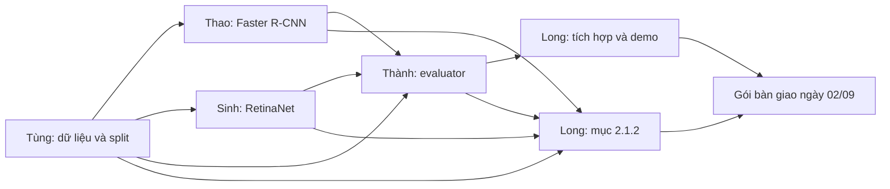

# PHÂN CÔNG TRIỂN KHAI HỆ THỐNG CHO NHÓM 5 THÀNH VIÊN

## 0. Thông tin chung

- **Căn cứ:** `KE_HOACH_HE_THONG.md` đã được Nguyễn Thành Long duyệt ngày 25/08/2026.
- **Hạn hoàn thành kỹ thuật:** 23:59 ngày 02/09/2026.
- **Mốc nhóm bắt đầu ghép báo cáo:** 03/09/2026.
- **Thành viên:** Tùng, Thao, Sinh, Thành và Nguyễn Thành Long.
- **Mục tiêu:** có hai checkpoint, cùng evaluator, bảng so sánh, demo và gói dữ liệu thật phục vụ báo cáo.
- **Nguyên tắc:** mỗi tệp/mô-đun có một người chịu trách nhiệm chính; mọi thành viên khác góp ý qua pull request để tránh ghi đè mã.

Tài liệu này phân công phần triển khai kỹ thuật và đầu ra phục vụ báo cáo. Nó không thay thế toàn bộ phân công viết lý thuyết trong `Phân chia CV_AI.docx`.

## 1. Sơ đồ phụ thuộc công việc



Các phần có thể chuẩn bị song song, nhưng không được train chính thức trước khi split và evaluator được đóng băng.

## 2. Bảng phân công tổng quát

| Thành viên | Vai trò kỹ thuật | Đầu ra chính | Nhánh Git | Hạn quan trọng |
|---|---|---|---|---|
| Tùng | Dataset Owner | Dataset report, processed annotation, split manifest, DataLoader | `feature/data-pipeline` | Split đóng băng 27/08 |
| Thao | Faster R-CNN Owner | Model factory, config, smoke test và checkpoint Faster R-CNN | `feature/faster-rcnn` | Checkpoint chính thức 29/08 |
| Sinh | RetinaNet Owner | Model factory, config, smoke test và checkpoint RetinaNet | `feature/retinanet` | Checkpoint chính thức 30/08 |
| Thành | Evaluation Owner | IoU/P/R/mAP evaluator, test metric, bảng và biểu đồ so sánh | `feature/evaluation` | Metric cuối 01/09 |
| Long | Integration & Delivery Owner | Môi trường chung, tích hợp, benchmark, Streamlit, mục 2.1.2 và gói bàn giao | `feature/integration-demo` | Bàn giao 02/09 |

## 3. Phân công chi tiết

## 3.1. Tùng — Dataset Owner

### Mục tiêu

Biến dữ liệu EdgeVision gốc thành nguồn dữ liệu sạch, thống kê được và một split duy nhất để cả hai mô hình sử dụng.

### Việc phải làm

1. Tải EdgeVision v1 từ Mendeley và xác minh DOI, giấy phép, cấu trúc tệp.
2. Ghi checksum của annotation và danh sách ảnh.
3. Hoàn thiện `tools/inspect_dataset.py` để kiểm tra:
   - ảnh thiếu/hỏng;
   - ID trùng;
   - category mapping;
   - bounding box sai hoặc vượt biên;
   - số ảnh, số box và phân bố lớp.
4. Xem trực quan tối thiểu 30 annotation mỗi lớp và xác nhận semantics nhãn.
5. Hoàn thiện `src/dataset.py` và `src/transforms.py`.
6. Tạo processed annotation nếu dữ liệu cần sửa kỹ thuật; không sửa bản raw.
7. Hoàn thiện `tools/create_splits.py`:
   - seed 42;
   - tỷ lệ 70/15/15;
   - chống ảnh trùng/gần trùng giữa split;
   - cân bằng tương đối phân bố lớp.
8. Tạo thống kê và ảnh minh họa split.
9. Bàn giao hướng dẫn để các thành viên khác đặt dataset đúng đường dẫn.

### Tệp/mô-đun sở hữu chính

- `src/dataset.py`
- `src/transforms.py`
- `tools/inspect_dataset.py`
- `tools/create_splits.py`
- `tools/visualize_annotations.py`
- Phần dữ liệu trong `configs/common.yaml`
- Manifest và danh sách ID dưới `data/splits/`

### Đầu ra bắt buộc

- `dataset_report.json`
- `split_summary.json`
- `split_manifest.json`
- Danh sách train/validation/test ID.
- Ba COCO split hoặc công cụ sinh lại chúng từ manifest.
- Tối thiểu 9 ảnh annotation minh họa, ít nhất 3 ảnh/lớp.
- Ghi chú các annotation bị loại/clip, nếu có.

### Tiêu chí nghiệm thu

- Category ID đúng 1–3 và có giải thích rõ.
- Không có ảnh thiếu/hỏng chưa xử lý.
- Không có ID giao nhau giữa ba split.
- Ảnh trùng hoặc cùng nhóm cảnh không nằm ở nhiều split.
- DataLoader đọc được ít nhất một batch có ảnh kích thước khác nhau.
- Thống kê được sinh từ chương trình, không nhập tay.

### Hạn

- 26/08, 18:00: có dataset report và kết quả xem nhãn.
- 27/08, 12:00: có split nháp.
- 27/08, 20:00: split được kiểm tra và đóng băng.

### Không được làm

- Không thay đổi split sau khi xem test.
- Không xóa annotation lỗi mà không ghi log.
- Không commit ảnh dataset lên GitHub.
- Không tự đổi bài toán thành một lớp.

## 3.2. Thao — Faster R-CNN Owner

### Mục tiêu

Hoàn thiện và chạy xuyên suốt Faster R-CNN bằng dataset/split chung, sau đó bàn giao checkpoint và log có thể tái lập.

### Việc phải làm

1. Hoàn thiện model factory cho `fasterrcnn_resnet50_fpn_v2`.
2. Tải pretrained COCO và thay box predictor cho bốn lớp gồm nền.
3. Kiểm tra head, nhãn đầu vào và prediction output.
4. Hoàn thiện phần Faster R-CNN trong pipeline train chung.
5. Bảo đảm log đủ các loss:
   - classification loss;
   - box regression loss;
   - objectness loss;
   - RPN box regression loss;
   - tổng loss.
6. Chạy unit test và smoke test trên split nhỏ.
7. Chạy train chính thức trên Kaggle ngày 29/08.
8. Lưu `best.pth` theo validation mAP@0.5:0.95 và `last.pth` mỗi epoch.
9. Bàn giao manifest, config, history, validation metric và checkpoint hash.
10. Cung cấp mô tả cấu hình/thực nghiệm cho Long viết mục 2.1.2.

### Tệp/mô-đun sở hữu chính

- Module Faster R-CNN trong model factory.
- `configs/faster_rcnn.yaml`
- Test riêng cho Faster R-CNN.
- Thư mục run chính thức dưới `outputs/faster_rcnn/`.

Không sửa evaluator hoặc logic chia dữ liệu nếu chưa trao đổi với chủ sở hữu tương ứng.

### Đầu ra bắt buộc

- Smoke checkpoint.
- `best.pth` và `last.pth` chính thức.
- `history.csv`.
- `val_metrics.json`.
- `run_manifest.json`.
- SHA-256 checkpoint.
- Tối thiểu 5 prediction mẫu.
- Tóm tắt lỗi hoặc thay đổi cấu hình đã xảy ra.

### Tiêu chí nghiệm thu

- Một bước forward/backward cho loss hữu hạn.
- Resume từ checkpoint hoạt động.
- Model trả `boxes`, `labels`, `scores` đúng cấu trúc.
- Không xuất label ngoài 1–3 ở prediction được giữ lại.
- Best checkpoint có metric validation và run ID rõ ràng.
- Không dùng test để chọn epoch hoặc sửa hyperparameter.

### Hạn

- 27/08, 20:00: model factory và unit test cơ bản.
- 28/08, 18:00: smoke test hoàn tất.
- 29/08, 23:59: checkpoint chính thức và artifact được lưu bền vững.

### Không được làm

- Không train bằng split riêng.
- Không đổi kích thước ảnh/augmentation mà không cập nhật config và thông báo Long.
- Không so sánh loss tuyệt đối của Faster R-CNN với loss RetinaNet để kết luận chất lượng.
- Không commit checkpoint vào Git.

## 3.3. Sinh — RetinaNet Owner

### Mục tiêu

Hoàn thiện và chạy xuyên suốt RetinaNet trên cùng dữ liệu, evaluator và nguyên tắc tái lập như Faster R-CNN.

### Việc phải làm

1. Hoàn thiện model factory cho `retinanet_resnet50_fpn_v2`.
2. Tải pretrained COCO và thay classification head cho bốn lớp gồm nền.
3. Kiểm tra anchor generator, classification head và box regression head.
4. Xác minh Focal Loss được model tính đúng trong chế độ train.
5. Tích hợp RetinaNet vào pipeline train chung, không tạo train loop riêng bị lệch giao thức.
6. Chạy unit test và smoke test trên cùng split nhỏ với Faster R-CNN.
7. Chạy train chính thức trên Kaggle ngày 30/08, cùng loại GPU đã dùng ngày 29/08.
8. Lưu `best.pth` và `last.pth` theo cùng quy tắc.
9. Bàn giao manifest, config, history, validation metric và checkpoint hash.
10. Cung cấp giải thích Focal Loss, cấu hình và vấn đề thực nghiệm cho phần báo cáo tương ứng.

### Tệp/mô-đun sở hữu chính

- Module RetinaNet trong model factory.
- `configs/retinanet.yaml`
- Test riêng cho RetinaNet.
- Thư mục run chính thức dưới `outputs/retinanet/`.

### Đầu ra bắt buộc

- Smoke checkpoint.
- `best.pth` và `last.pth` chính thức.
- `history.csv`.
- `val_metrics.json`.
- `run_manifest.json`.
- SHA-256 checkpoint.
- Tối thiểu 5 prediction mẫu.
- Ghi chú Focal Loss và mọi thay đổi cấu hình.

### Tiêu chí nghiệm thu

- Classification và regression loss hữu hạn.
- Resume hoạt động.
- Prediction có đúng ba lớp đối tượng và score hợp lệ.
- Dùng đúng split/config chung và cùng loại Kaggle GPU.
- Best checkpoint được chọn bằng validation mAP@0.5:0.95.
- Không dùng test để chọn cấu hình.

### Hạn

- 27/08, 20:00: model factory và unit test cơ bản.
- 28/08, 18:00: smoke test hoàn tất.
- 30/08, 23:59: checkpoint chính thức và artifact được lưu bền vững.

### Không được làm

- Không tự đổi category ID về 0–2 mà không có adapter được kiểm thử.
- Không dùng augmentation hoặc image size riêng mà không ghi rõ.
- Không thay evaluator bằng cách tính metric riêng.
- Không commit checkpoint vào Git.

## 3.4. Thành — Evaluation Owner

### Mục tiêu

Xây dựng một evaluator duy nhất cho cả hai mô hình và sinh toàn bộ số liệu/bảng so sánh bằng chương trình.

### Việc phải làm

1. Hoàn thiện IoU và matching cùng lớp, một-một.
2. Viết unit test cho TP, FP, FN, duplicate prediction và trường hợp rỗng.
3. Hoàn thiện COCO mAP bằng TorchMetrics/pycocotools.
4. Xuất:
   - mAP@0.5:0.95;
   - mAP@0.5;
   - AP từng lớp;
   - mAR@100 nếu evaluator hỗ trợ ổn định.
5. Chọn confidence threshold cho `NoHelmet` trên validation bằng F1 cao nhất.
6. Khóa threshold rồi tính Precision/Recall/F1 trên test.
7. Hoàn thiện `src/evaluate.py` và schema `test_metrics.json`.
8. Hoàn thiện `src/compare_models.py` để sinh CSV và biểu đồ.
9. Chạy evaluator lên cả hai checkpoint bằng cùng commit.
10. Bàn giao bảng/biểu đồ và mô tả cách tính cho Long; Long viết phần phương pháp trong mục 2.1.2.

### Tệp/mô-đun sở hữu chính

- `src/metrics.py`
- `src/evaluate.py`
- `src/compare_models.py`
- `tests/test_metrics.py`
- `outputs/comparison/`
- Bảng/biểu đồ metric trong `report/tables/` và `report/figures/`.

### Đầu ra bắt buộc

- Unit test metric.
- `val_metrics.json` và `test_metrics.json` chuẩn hóa cho mỗi model.
- `comparison.csv`.
- Biểu đồ AP theo lớp.
- Biểu đồ validation mAP theo epoch.
- Ghi chú evaluator version, IoU threshold và confidence threshold.
- Danh sách TP/FP/FN `NoHelmet` để phân tích lỗi.

### Tiêu chí nghiệm thu

- Synthetic perfect prediction cho metric hoàn hảo.
- Duplicate prediction chỉ có một TP.
- Cả hai model dùng cùng code evaluator và split hash.
- mAP không bị cắt bởi confidence threshold dùng cho demo.
- Precision/Recall test sử dụng threshold đã chọn từ validation.
- Mỗi số trong `comparison.csv` truy được về JSON nguồn.

### Hạn

- 27/08, 20:00: unit test và evaluator synthetic đạt.
- 28/08, 18:00: evaluator chạy được trên smoke checkpoint.
- 31/08, 20:00: sẵn sàng nhận hai checkpoint chính thức.
- 01/09, 18:00: hoàn tất test metric, CSV và biểu đồ.

### Không được làm

- Không lựa chọn threshold bằng test.
- Không dùng hai cách tính metric khác nhau cho hai model.
- Không sửa số trong CSV để “đẹp” hơn.
- Không kết luận model nào tốt hơn thay cho phần phân tích chung khi chưa có benchmark.

## 3.5. Nguyễn Thành Long — Integration & Delivery Owner

### Mục tiêu

Giữ pipeline thống nhất, tích hợp artifact của bốn thành viên, benchmark hai model, hoàn thiện demo và bàn giao dữ liệu thật cho báo cáo.

### Việc phải làm

1. Khóa môi trường chung và ghi `environment.json`.
2. Duy trì `configs/common.yaml`, config inheritance và schema kiểm tra.
3. Điều phối ranh giới module để tránh Thao/Sinh sửa cùng một đoạn model factory.
4. Tích hợp pull request theo thứ tự dữ liệu → evaluator → model/train → demo.
5. Xác minh smoke test hai model trước khi cho train chính thức.
6. Kiểm tra hai run dùng cùng split hash, evaluator, seed và loại GPU.
7. Hoàn thiện `src/infer.py`, `app/model_loader.py` và `app/app.py`.
8. Benchmark latency/FPS/peak VRAM trên RTX 2050 theo giao thức chung.
9. Tạo ảnh/video demo và ảnh chụp giao diện.
10. Viết mục 2.1.2:
    - quy trình fine-tune;
    - IoU, Precision, Recall, AP/mAP;
    - giao thức đánh giá công bằng;
    - cách diễn giải kết quả.
11. Nhận số liệu từ Thành, thống kê từ Tùng, cấu hình/log từ Thao và Sinh.
12. Kiểm tra không có kết quả giả, test leakage hoặc kết luận vượt quá bằng chứng.
13. Đóng gói artifact và hướng dẫn chạy trước 23:59 ngày 02/09.

### Tệp/mô-đun sở hữu chính

- Cấu hình chung và tài liệu điều phối.
- `src/infer.py`
- `tools/benchmark_speed.py`
- `app/`
- `report/2.1.2_huan_luyen_va_danh_gia.md`
- `report/experiment_manifest.md`
- README chạy hệ thống và demo.

### Đầu ra bắt buộc

- Environment report.
- Pipeline inference chung.
- Speed metrics của hai model.
- Demo Streamlit ảnh/video/camera snapshot.
- Ảnh chụp demo và prediction mẫu.
- Bản thảo mục 2.1.2 với placeholder chỉ ở dữ liệu thực sự chưa có.
- Gói bàn giao gồm code commit, config, metric, checkpoint link/hash và hướng dẫn.

### Tiêu chí nghiệm thu

- Demo chuyển model mà không phải sửa mã.
- Checkpoint sai schema/class mapping bị từ chối rõ ràng.
- Benchmark dùng cùng ảnh, batch và môi trường.
- Bảng trong báo cáo khớp JSON/CSV.
- Không nhận nhầm phần viết script metric của Thành.
- Không khẳng định “thời gian thực” nếu số liệu chưa chứng minh.

### Hạn

- 26/08, 20:00: môi trường và schema cấu hình chung.
- 28/08, 20:00: tích hợp smoke test và chốt cấu hình official.
- 01/09, 23:00: benchmark, inference và dữ liệu phân tích lỗi.
- 02/09, 18:00: demo và bản thảo kỹ thuật hoàn chỉnh.
- 02/09, 23:59: gói bàn giao cuối.

## 4. Ma trận trách nhiệm RACI

Ký hiệu: **R** = trực tiếp làm; **A** = chịu trách nhiệm cuối; **C** = cần tham vấn; **I** = được thông báo.

| Hạng mục | Tùng | Thao | Sinh | Thành | Long |
|---|---:|---:|---:|---:|---:|
| Kiểm định dataset | R | I | I | C | A |
| Tạo và đóng băng split | R | C | C | C | A |
| Faster R-CNN | I | R | C | C | A |
| RetinaNet | I | C | R | C | A |
| Evaluator và metric | C | C | C | R | A |
| Train Faster chính thức | I | R | I | I | A |
| Train Retina chính thức | I | I | R | I | A |
| Benchmark tốc độ | I | C | C | C | R/A |
| Demo Streamlit | I | C | C | I | R/A |
| Bảng so sánh | I | C | C | R | A |
| Mục báo cáo 2.1.2 | C | C | C | C | R/A |
| Gói bàn giao | I | C | C | C | R/A |

## 5. Quy tắc Git để làm chung

### 5.1. Nhánh

- Tùng: `feature/data-pipeline`
- Thao: `feature/faster-rcnn`
- Sinh: `feature/retinanet`
- Thành: `feature/evaluation`
- Long: `feature/integration-demo`

Sau khi bắt đầu triển khai, không thành viên nào đẩy trực tiếp mã tính năng vào `main`.

### 5.2. Pull request

Mỗi pull request phải ghi:

```text
Mục tiêu:
Tệp đã thay đổi:
Cách kiểm thử:
Đầu ra minh chứng:
Ảnh hưởng tới cấu hình/giao diện:
Phụ thuộc hoặc blocker:
```

Điều kiện merge:

- Không có xung đột chưa xử lý.
- Unit test liên quan đạt.
- Không chứa dataset, checkpoint, secret hoặc tệp lớn.
- Không tự thay đổi class mapping, split hoặc evaluator chung.
- Người sở hữu module liên quan đã xem lại.

### 5.3. Commit

Ưu tiên tiền tố:

- `feat:` chức năng mới.
- `fix:` sửa lỗi.
- `test:` kiểm thử.
- `docs:` tài liệu.
- `chore:` cấu hình/công việc phụ trợ.

Mỗi commit chỉ nên chứa một thay đổi logic rõ ràng.

## 6. Cơ chế phối hợp hằng ngày

Trước 21:00 mỗi ngày, mỗi thành viên gửi cập nhật ngắn:

```text
Đã làm:
Artifact/commit/PR:
Kết quả kiểm thử:
Blocker:
Việc tiếp theo:
Khả năng đúng hạn: xanh / vàng / đỏ
```

Quy tắc blocker:

- Vướng quá 2 giờ phải báo, không chờ đến cuối ngày.
- OOM, dataset sai hoặc evaluator sai là blocker đỏ.
- Không có artifact/commit thì không coi là đã hoàn thành chỉ vì đã “chạy thử”.
- Nếu một thành viên chậm mốc, Long điều phối người hỗ trợ nhưng không tự ý thay đổi giao thức.

## 7. Lịch tích hợp chung

| Ngày | Tùng | Thao | Sinh | Thành | Long |
|---|---|---|---|---|---|
| 26/08 | Dataset report | Chuẩn bị Faster factory | Chuẩn bị Retina factory | Khung evaluator | Môi trường/config chung |
| 27/08 | Đóng băng split | Unit test Faster | Unit test Retina | Metric synthetic | Tích hợp dữ liệu/evaluator |
| 28/08 | Hỗ trợ lỗi dữ liệu | Smoke Faster | Smoke Retina | Evaluate smoke | Chốt official config |
| 29/08 | Theo dõi dữ liệu | Train Faster | Chuẩn bị Retina run | Kiểm log/val metric | Kiểm manifest/backup |
| 30/08 | Hỗ trợ | Bàn giao Faster | Train Retina | Kiểm log/val metric | Kiểm cùng GPU/config |
| 31/08 | Hỗ trợ lỗi | Resume/sửa nếu cần | Resume/sửa nếu cần | Khóa evaluator | Khóa hai checkpoint |
| 01/09 | Cung cấp thống kê | Phân tích lỗi Faster | Phân tích lỗi Retina | Test/CSV/biểu đồ | Benchmark/inference |
| 02/09 | Bàn giao data notes | Bàn giao model notes | Bàn giao model notes | Bàn giao metric notes | Demo, mục 2.1.2, gói cuối |

## 8. Quy tắc thay đổi phạm vi khi có nguy cơ trễ

Thứ tự cắt giảm:

1. Bỏ lần tuning bổ sung nếu baseline hợp lệ.
2. Bỏ webcam live; giữ camera snapshot.
3. Bỏ biểu đồ phụ; giữ bảng metric và AP theo lớp.
4. Giới hạn video demo ngắn.
5. Không bỏ test cuối, split manifest, hai checkpoint, evaluator chung hoặc provenance số liệu.

Không được cắt một trong hai mô hình vì sẽ làm mất mục tiêu so sánh của đề tài.

## 9. Gói bàn giao cho báo cáo ngày 02/09

### Tùng cung cấp

- Nguồn, phiên bản, giấy phép dataset.
- Số ảnh/box/lớp đã xác minh.
- Mô tả kiểm định, tiền xử lý, split và augmentation.
- Bảng thống kê và ảnh annotation.

### Thao cung cấp

- Kiến trúc/biến thể Faster R-CNN đã dùng.
- Hyperparameter cuối.
- Training history, checkpoint và validation metric.
- Ghi chú vấn đề trong quá trình train.

### Sinh cung cấp

- Kiến trúc/biến thể RetinaNet đã dùng.
- Hyperparameter cuối và Focal Loss.
- Training history, checkpoint và validation metric.
- Ghi chú vấn đề trong quá trình train.

### Thành cung cấp

- Định nghĩa evaluator và quy tắc TP/FP/FN.
- Test metric JSON/CSV.
- Confidence threshold và IoU threshold.
- Bảng/biểu đồ so sánh.

### Long tổng hợp

- Giao thức fine-tune và đánh giá công bằng.
- Benchmark tốc độ/tài nguyên.
- Demo, hình chụp giao diện và hướng dẫn chạy.
- Mục 2.1.2, experiment manifest và liên kết artifact.

## 10. Điều kiện đóng dự án kỹ thuật

- [ ] Split đã đóng băng và không rò rỉ.
- [ ] Faster R-CNN có checkpoint hợp lệ.
- [ ] RetinaNet có checkpoint hợp lệ.
- [ ] Cùng evaluator, class mapping và test split.
- [ ] Test metric được xuất tự động.
- [ ] Benchmark hai model trên cùng RTX 2050.
- [ ] Demo chạy được với cả hai checkpoint.
- [ ] Artifact có run ID, commit và hash.
- [ ] Không có số liệu giả hoặc test leakage.
- [ ] Gói bàn giao hoàn tất trước 23:59 ngày 02/09/2026.

