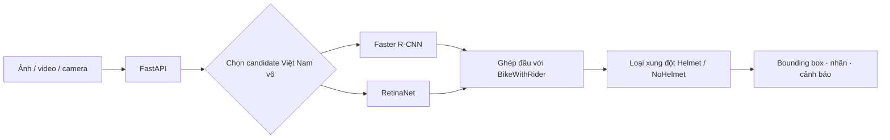

# Phát hiện người điều khiển xe máy không đội mũ bảo hiểm

<p align="center">
  So sánh <strong>Faster R-CNN</strong> và <strong>RetinaNet</strong>, đồng thời xây dựng demo phát hiện trên ảnh, video và camera.
</p>

<p align="center">
  
  
  
  
  
</p>

## Trạng thái hiện tại

README phân biệt hai nhóm mô hình để tránh nhầm số liệu:

- **Baseline EdgeVision** là thí nghiệm gốc dùng để viết báo cáo và so sánh công bằng. Các metric test tại phần dưới thuộc **dataset EdgeVision cũ**, không phải kết quả của model đang hiển thị trên demo.
- **Candidate Việt Nam v6** được fine-tune thêm từ checkpoint baseline. Giao diện hiện chỉ hiển thị hai candidate này để kiểm tra trực quan. Candidate chưa vượt deployment gate trên validation nên chưa thay thế baseline trong kết luận học thuật.
- Checkpoint baseline vẫn được giữ nguyên trong backend để đối chiếu và rollback; không bị ghi đè bởi candidate.

## Bài toán

Đầu vào là ảnh giao thông. Đầu ra gồm khung giới hạn (*bounding box*), nhãn lớp và độ tin cậy cho ba lớp:

| ID | Lớp | Ý nghĩa |
| ---: | --- | --- |
| 1 | `BikeWithRider` | Xe máy và người đang ngồi trên xe |
| 2 | `NoHelmet` | Vùng đầu không đội mũ bảo hiểm |
| 3 | `Helmet` | Vùng đầu có đội mũ bảo hiểm |

Dự án dùng cùng pipeline dữ liệu và evaluator để so sánh:

- **Faster R-CNN**: mô hình phát hiện đối tượng hai giai đoạn.
- **RetinaNet**: mô hình phát hiện đối tượng một giai đoạn sử dụng Focal Loss.



## Dữ liệu

### Baseline EdgeVision cũ

Baseline sử dụng [EdgeVision v1](https://doi.org/10.17632/j82bnw7gsr.1), annotation COCO JSON. Sau bước kiểm tra và chuẩn hóa, dữ liệu có **2.392 ảnh** và **8.275 annotation**:

| Tập | Số ảnh | Số annotation |
| --- | ---: | ---: |
| Train | 1.673 | 5.801 |
| Validation | 360 | 1.236 |
| Test | 359 | 1.238 |
| **Tổng** | **2.392** | **8.275** |

| Lớp | Số annotation |
| --- | ---: |
| `BikeWithRider` | 3.793 |
| `NoHelmet` | 2.810 |
| `Helmet` | 1.672 |

Split được đóng băng theo seed 42. Faster R-CNN và RetinaNet dùng cùng train/validation/test, cùng mapping lớp và cùng evaluator. Tập test chỉ được dùng sau khi đã chọn checkpoint và cấu hình trên validation.

### Dữ liệu candidate Việt Nam v6

Candidate v6 không học từ dữ liệu mới riêng lẻ. Tập train được gộp từ **1.673 ảnh EdgeVision train**, **449 ảnh giao thông Việt Nam đã duyệt** và **4 ảnh Wikimedia đã duyệt trực quan**, tổng cộng **2.126 ảnh** với **7.224 annotation**.

| Tập của candidate v6 | Số ảnh | `BikeWithRider` | `NoHelmet` | `Helmet` | Tổng box |
| --- | ---: | ---: | ---: | ---: | ---: |
| Train | 2.126 | 3.309 | 2.049 | 1.866 | 7.224 |
| EdgeVision validation khóa | 360 | 566 | 420 | 250 | 1.236 |
| EdgeVision test khóa | 359 | 566 | 422 | 250 | 1.238 |
| `vn_validation` riêng | 118 | 192 | 31 | 188 | 411 |

Validation và test EdgeVision được giữ nguyên byte/checksum so với baseline. `vn_validation` cũng được tách riêng; ảnh cùng nguồn/video không được chia ngẫu nhiên sang nhiều tập.

Nguồn dữ liệu bổ sung:

- [Helmet/NoHelmet/LP v24](https://universe.roboflow.com/cdio-zmfmj/helmet-lincense-plate-detection-gevlq/dataset/24), giấy phép CC BY 4.0. Lớp biển số `LP` không được dùng.
- [Motobike v18](https://universe.roboflow.com/cdio-zmfmj/motobike-detection/dataset/18), giấy phép CC BY 4.0. Box `motobike` chỉ là gợi ý và không được tự động coi là `BikeWithRider` hoàn chỉnh.
- [Kho mã nguồn của nhóm CDIO](https://github.com/ThanhSan97/Helmet-Violation-Detection-Using-YOLO-and-VGG16), dùng để đối chiếu nguồn công bố.
- Một số ảnh Wikimedia Commons có giấy phép theo từng ảnh; provenance được lưu trong manifest dữ liệu cục bộ.

Nguồn VietnameseHelmetDetection không có annotation đủ tin cậy đã bị loại, không được dùng làm dữ liệu âm hoặc ground truth.

## Kết quả thực nghiệm

### 1. Baseline trên dữ liệu EdgeVision cũ

> **Lưu ý:** bảng này là kết quả lịch sử của hai baseline 20 epoch trên **EdgeVision test 359 ảnh**. Đây không phải metric của hai candidate Việt Nam v6 đang chạy trên giao diện.

Hai baseline được huấn luyện trên GPU **NVIDIA GeForce RTX 2050**, `batch_size = 1`, kích thước ảnh từ 512 đến 768 px và trọng số khởi tạo Torchvision `DEFAULT`. Checkpoint được chọn theo validation mAP@0.5:0.95.

| Mô hình baseline | Best epoch | Test mAP@0.5:0.95 ↑ | Test mAP@0.5 ↑ | Test mAP@0.75 ↑ | Latency validation ↓ | FPS validation ↑ |
| --- | ---: | ---: | ---: | ---: | ---: | ---: |
| Faster R-CNN | 9 | 0.6562 | 0.9070 | 0.7400 | 163,59 ms | 6,11 |
| RetinaNet | 8 | 0.6472 | 0.8990 | 0.7457 | 75,24 ms | 13,29 |

Trong lần chạy này, Faster R-CNN cao hơn 0,0090 mAP@0.5:0.95; RetinaNet có latency thấp hơn khoảng 2,17 lần. Kết luận này chỉ áp dụng cho split, cấu hình và phần cứng đã nêu.

Latency được đo trên validation với 20 ảnh warm-up và 100 ảnh đo, batch size 1. Thời gian gồm chuyển tensor lên GPU, tiền xử lý nội bộ, suy luận, hậu xử lý và NMS; không gồm đọc tệp hoặc render giao diện.

### 2. Candidate Việt Nam v6 trên EdgeVision validation khóa

Mỗi candidate bắt đầu từ `best_map.pth` của baseline tương ứng, đóng băng thân backbone và fine-tune thêm **1 epoch** trên tập train gộp. Learning rate là `2.5e-5`, batch size 1, không dùng weighted sampling và không dùng color jitter mạnh.

| Candidate v6 | Val mAP@0.5:0.95 | Val mAP@0.5 | Val mAP@0.75 | AP `BikeWithRider` | AP `NoHelmet` | AP `Helmet` |
| --- | ---: | ---: | ---: | ---: | ---: | ---: |
| Faster R-CNN v6 | 0.6512 | 0.9160 | 0.7350 | 0.7965 | 0.5219 | 0.6352 |
| RetinaNet v6 | 0.6404 | 0.9059 | 0.7180 | 0.7865 | 0.5096 | 0.6251 |

So với checkpoint baseline trên cùng EdgeVision validation khóa:

| Mô hình | Baseline val mAP | Candidate v6 val mAP | Chênh lệch | Baseline AP `NoHelmet` | Candidate AP `NoHelmet` | Chênh lệch |
| --- | ---: | ---: | ---: | ---: | ---: | ---: |
| Faster R-CNN | 0.6519 | 0.6512 | -0.0007 | 0.5265 | 0.5219 | -0.0046 |
| RetinaNet | 0.6443 | 0.6404 | -0.0039 | 0.5218 | 0.5096 | -0.0122 |

Vì mAP và AP `NoHelmet` đều không tăng, hai candidate **chưa qua deployment gate định lượng**. Chúng được đưa vào demo theo yêu cầu kiểm tra trực quan và không được dùng để thay số liệu baseline trong báo cáo. Candidate chưa được đánh giá test để tránh sử dụng test trong quá trình lựa chọn.

## Demo hiện tại

| Faster R-CNN Việt Nam v6 | RetinaNet Việt Nam v6 |
| --- | --- |
|  |  |

Giao diện hiện chỉ hiển thị:

- `Faster R-CNN · thử nghiệm VN`;
- `RetinaNet · thử nghiệm VN`.

Ứng dụng hỗ trợ ảnh JPG/JPEG/PNG, video MP4/MOV/AVI tối đa 200 MB và 5 phút, cùng camera snapshot. Video được xử lý tuần tự từng frame, không được xem là camera thời gian thực.

Hậu xử lý dùng `BikeWithRider` để ghép vùng đầu với xe-người, loại xung đột `Helmet`/`NoHelmet` trên cùng vùng đầu và chỉ tạo cảnh báo khi quan hệ đủ rõ. Nhãn “Không xác định” không được hiển thị trên ảnh hoặc giao diện.

Candidate đang kế thừa threshold theo lớp và horizontal-flip TTA của baseline để thử nghiệm trực quan:

| Candidate | `BikeWithRider` | `NoHelmet` | `Helmet` |
| --- | ---: | ---: | ---: |
| Faster R-CNN v6 | 0.95 | 0.65 | 0.70 |
| RetinaNet v6 | 0.65 | 0.40 | 0.40 |

Các threshold này **chưa được chọn lại riêng cho candidate v6**, vì vậy không được mô tả là threshold tối ưu của model mới.

## Cài đặt và chạy nhanh

### 1. Điều kiện cần

- Windows và Python 3.11.
- Node.js và npm để chạy giao diện React.
- GPU NVIDIA/CUDA để train và demo nhanh hơn; có thể cài chế độ CPU nếu không có GPU.
- Dataset và checkpoint do nhóm chia sẻ riêng; các tệp lớn này không được lưu trong Git.

### 2. Cài môi trường Python

Mở PowerShell tại thư mục gốc dự án:

```powershell
powershell -ExecutionPolicy Bypass -File .\tools\setup_environment.ps1 -InstallMode gpu
.\.venv\Scripts\python.exe .\tools\check_environment.py
```

Xem các chế độ `gpu`, `cpu` và `data` tại [`HUONG_DAN_CAI_DAT.md`](HUONG_DAN_CAI_DAT.md).

### 3. Đặt checkpoint

```text
outputs/
├── faster_rcnn/checkpoints/best_map.pth
├── retinanet/checkpoints/best_map.pth
└── vietnam_pilot_v6_wikimedia/
    ├── faster_rcnn/stage1/checkpoints/best_map.pth
    └── retinanet/stage1/checkpoints/best_map.pth
```

Hai checkpoint baseline cần được giữ để đối chiếu/rollback. Hai checkpoint v6 là model đang hiển thị trên demo.

### 4. Chạy backend và frontend

Mở hai cửa sổ PowerShell tại thư mục dự án.

**Cửa sổ 1 — FastAPI**

```powershell
.\.venv\Scripts\python.exe -m uvicorn app.api:app --host 127.0.0.1 --port 8000
```

**Cửa sổ 2 — React**

```powershell
Set-Location .\frontend
npm ci
npm run dev
```

Mở `http://127.0.0.1:5173/`. Frontend mặc định gọi backend tại `http://127.0.0.1:8000`; đặt `VITE_API_URL` nếu backend chạy ở địa chỉ khác.

## Tái lập thí nghiệm

> Các lệnh train ghi checkpoint vào `outputs/`. Hãy sao lưu artifact hiện có hoặc đổi `output.directory` trước khi chạy để không ghi đè baseline.

### Baseline EdgeVision

```powershell
# Smoke test
python -m src.train --config configs\faster_rcnn.yaml --smoke-test
python -m src.train --config configs\retinanet.yaml --smoke-test

# Train baseline
python -m src.train --config configs\faster_rcnn.yaml --device cuda
python -m src.train --config configs\retinanet.yaml --device cuda

# Chỉ đánh giá test sau khi đã chốt cấu hình
python -m src.evaluate --config configs\faster_rcnn.yaml --split test
python -m src.evaluate --config configs\retinanet.yaml --split test
```

### Candidate Việt Nam v6

```powershell
# Smoke test
python -m src.train --config configs\vietnam_v6_wikimedia_faster_rcnn.yaml --smoke-test
python -m src.train --config configs\vietnam_v6_wikimedia_retinanet.yaml --smoke-test

# Fine-tune 1 epoch từ baseline
python -m src.train --config configs\vietnam_v6_wikimedia_faster_rcnn.yaml --device cuda
python -m src.train --config configs\vietnam_v6_wikimedia_retinanet.yaml --device cuda
```

Candidate mới phải được so với baseline trên cùng validation bằng `tools/check_deployment_gate.py`. Không dùng test để điều chỉnh checkpoint hoặc threshold.

## Checkpoint

| Mô hình | Checkpoint | SHA-256 |
| --- | --- | --- |
| Faster R-CNN baseline | `outputs/faster_rcnn/checkpoints/best_map.pth` | `27fc925e68cd908e82b3865f3781ea01ee643c67674a392e62d7893d59f92682` |
| RetinaNet baseline | `outputs/retinanet/checkpoints/best_map.pth` | `5f3e4cb963e2c079094254b261dec15e21b0b2784d5aa1fd34756ff006ed5ed5` |
| Faster R-CNN Việt Nam v6 | `outputs/vietnam_pilot_v6_wikimedia/faster_rcnn/stage1/checkpoints/best_map.pth` | `6869faff03a30c497fd60d1a61ef624ae2cc41e261b55030efd8816a980f8348` |
| RetinaNet Việt Nam v6 | `outputs/vietnam_pilot_v6_wikimedia/retinanet/stage1/checkpoints/best_map.pth` | `d02de4c3a4e76bb4a7898ff8ca04f40104085696532e60a1521f6fa08650263b` |

`best_map.pth` là checkpoint có validation mAP@0.5:0.95 tốt nhất trong chính lần chạy đó. Dataset, checkpoint, log và artifact sinh tự động không được commit lên GitHub. Khi bàn giao, cần đối chiếu SHA-256 và manifest.

## Cấu trúc dự án

```text
helmet_detection_project/
├── app/                 # FastAPI, nạp model và xử lý video
├── configs/             # Cấu hình train, candidate và demo
├── data/                # Dataset cục bộ, annotation và split
├── frontend/            # React + TypeScript
├── outputs/             # Checkpoint, metric và log cục bộ
├── report/              # Nội dung, bảng và hình dùng cho báo cáo
├── src/                 # Dataset, model, train, evaluate và inference
├── tests/               # Kiểm thử tự động
└── tools/               # Xử lý dữ liệu, benchmark và deployment gate
```

## Kiểm thử

```powershell
.\.venv\Scripts\python.exe -m pytest
Set-Location .\frontend
npm run build
```

Lần kiểm tra gần nhất của mã nguồn hiện tại: **132 test passed, 1 skipped**; frontend build thành công. Đây là kiểm thử phần mềm, không thay thế đánh giá chất lượng mô hình trên validation/test.

## Giới hạn

- Metric baseline chỉ áp dụng cho EdgeVision v1 và split đã đóng băng.
- Candidate v6 chưa vượt baseline trên EdgeVision validation và chưa có kết quả test chính thức.
- Dữ liệu Việt Nam còn ít, đặc biệt `NoHelmet` trong `vn_validation`; chưa đủ để khẳng định khả năng tổng quát trên mọi camera giao thông Việt Nam.
- Threshold candidate hiện kế thừa từ baseline và vẫn đang ở trạng thái thử nghiệm.
- Benchmark dùng batch size 1 trên RTX 2050; không suy rộng thành cam kết thời gian thực cho mọi thiết bị.
- Hệ thống chỉ phục vụ học tập và minh họa. Kết quả cần được con người kiểm tra trước khi sử dụng cho giám sát hoặc xử phạt.

## Tài liệu liên quan

- [`HUONG_DAN_CAI_DAT.md`](HUONG_DAN_CAI_DAT.md): cài đặt môi trường.
- [`configs/README.md`](configs/README.md): cấu hình thí nghiệm đang công khai.
- [`app/README.md`](app/README.md): cấu trúc backend và model demo.
- [`frontend/README.md`](frontend/README.md): phát triển frontend.
- [`report/experiment_manifest.md`](report/experiment_manifest.md): manifest baseline dùng trong báo cáo.
- [`report/2.1.2_huan_luyen_va_danh_gia.md`](report/2.1.2_huan_luyen_va_danh_gia.md): phương pháp huấn luyện và đánh giá.

## Đóng góp

Dự án được thực hiện trong học phần Trí tuệ nhân tạo. Mỗi lần thay đổi dữ liệu hoặc huấn luyện lại phải lưu config, split hash, checkpoint hash, metric và điều kiện phần cứng để kết quả có thể kiểm tra và tái lập ở mức hợp lý.
