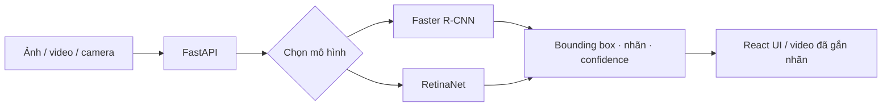

# Phát hiện người điều khiển xe máy không đội mũ bảo hiểm

<p align="center">
  Fine-tune, đánh giá công bằng và demo <strong>Faster R-CNN</strong> cùng <strong>RetinaNet</strong> trên ảnh giao thông.
</p>

<p align="center">
  
  
  
  
  
</p>

## Mục lục

- [Tổng quan](#tổng-quan)
- [Kết quả baseline](#kết-quả-baseline)
- [Demo](#demo)
- [Dữ liệu và giao thức đánh giá](#dữ-liệu-và-giao-thức-đánh-giá)
- [Cài đặt và chạy nhanh](#cài-đặt-và-chạy-nhanh)
- [Tái lập thí nghiệm](#tái-lập-thí-nghiệm)
- [Cấu trúc dự án](#cấu-trúc-dự-án)
- [Checkpoint và dữ liệu](#checkpoint-và-dữ-liệu)
- [Giới hạn](#giới-hạn)
- [Tài liệu liên quan](#tài-liệu-liên-quan)

## Tổng quan

Bài toán đầu vào là ảnh giao thông; đầu ra gồm khung giới hạn (*bounding box*), nhãn lớp và độ tin cậy. Dự án sử dụng cùng dữ liệu, cùng cách chia tập, cùng evaluator và cùng điều kiện benchmark để so sánh hai kiến trúc:

- **Faster R-CNN**: mô hình phát hiện đối tượng hai giai đoạn.
- **RetinaNet**: mô hình phát hiện đối tượng một giai đoạn, sử dụng Focal Loss.

Ứng dụng demo gồm FastAPI và React, hỗ trợ ảnh, video và camera snapshot. Video được xử lý tuần tự từng frame, không được xem là suy luận camera thời gian thực.



## Kết quả baseline

Hai baseline đã hoàn thành 20 epoch trên GPU **NVIDIA GeForce RTX 2050**, với `batch_size = 1`, kích thước ảnh từ 512 đến 768 px và trọng số khởi tạo Torchvision `DEFAULT`. Checkpoint được chọn theo mAP@0.5:0.95 trên validation; test chỉ dùng cho đánh giá cuối cùng.

| Mô hình | Best epoch | Test mAP@0.5:0.95 ↑ | Test mAP@0.5 ↑ | Test mAP@0.75 ↑ | Latency trung bình ↓ | FPS ↑ |
| --- | ---: | ---: | ---: | ---: | ---: | ---: |
| Faster R-CNN | 9 | 0.6562 | 0.9070 | 0.7400 | 163.59 ms | 6.11 |
| RetinaNet | 8 | 0.6472 | 0.8990 | 0.7457 | 75.24 ms | 13.29 |

Kết quả mAP được tính trên **359 ảnh test** với COCO mAP@[IoU=0.50:0.95]. Tốc độ được đo trên validation với 20 ảnh warm-up và 100 ảnh đo, batch size 1; thời gian gồm chuyển tensor lên GPU, tiền xử lý nội bộ của detector, suy luận, hậu xử lý và NMS; không gồm đọc tệp hay render giao diện.

Faster R-CNN cao hơn RetinaNet 0.0090 mAP@0.5:0.95 trong lần chạy này, trong khi RetinaNet nhanh hơn khoảng 2.17 lần theo latency trung bình. Đây là kết quả của cấu hình và phần cứng nêu trên, không phải khẳng định một mô hình luôn tốt hơn trong mọi điều kiện.

Ngưỡng confidence mặc định cho demo được chọn **trên validation**, tối ưu F1 cho lớp `NoHelmet` tại IoU = 0.5: 0.85 cho Faster R-CNN và 0.60 cho RetinaNet. Tập test không được dùng để chọn ngưỡng.

Nguồn số liệu cục bộ: `outputs/comparison/test_comparison.json`, cùng các `test_metrics.json`, `latency_validation.json` và `validation_threshold_selection.json` của từng mô hình. Các artifact này không được đưa lên GitHub theo chính sách lưu trữ của dự án.

## Demo

| Faster R-CNN | RetinaNet |
| --- | --- |
|  |  |

Giao diện cho phép:

- tải ảnh JPG/JPEG/PNG, chọn Faster R-CNN hoặc RetinaNet, rồi xem nhãn, khung giới hạn, confidence và latency;
- tải video MP4/MOV/AVI tối đa 200 MB và 5 phút, theo dõi tiến độ và tải video MP4 đã gắn nhãn;
- mở camera trên trình duyệt, chụp một frame rồi chạy suy luận ảnh.

## Dữ liệu và giao thức đánh giá

Baseline sử dụng EdgeVision v1 với annotation COCO JSON. Sau kiểm tra và chuẩn bị annotation, dữ liệu có **2.392 ảnh**, **8.275 annotation** và ba lớp:

| Lớp | Số annotation |
| --- | ---: |
| `BikeWithRider` | 3.793 |
| `NoHelmet` | 2.810 |
| `Helmet` | 1.672 |

Split được đóng băng theo seed 42: 1.673 ảnh train, 360 ảnh validation và 359 ảnh test. Cả hai mô hình dùng cùng split, cùng mapping lớp và cùng evaluator. Precision/Recall theo ngưỡng IoU 0.5 sử dụng matching một-một, cùng lớp, sắp theo confidence giảm dần; mAP dùng pycocotools/TorchMetrics theo chuẩn COCO.

## Cài đặt và chạy nhanh

### 1. Điều kiện cần

- Windows với Python 3.11.
- Node.js và npm để chạy giao diện React.
- GPU NVIDIA/CUDA là lựa chọn phù hợp để train và demo nhanh hơn; cài theo chế độ `cpu` nếu không có GPU.
- Dataset EdgeVision và hai checkpoint `best_map.pth` do nhóm cung cấp; các tệp này không được lưu trong Git.

### 2. Cài môi trường Python

Mở PowerShell ở thư mục gốc dự án:

```powershell
powershell -ExecutionPolicy Bypass -File .\tools\setup_environment.ps1 -InstallMode gpu
.\.venv\Scripts\python.exe .\tools\check_environment.py
```

Xem chi tiết các chế độ `gpu`, `cpu` và `data` tại [`HUONG_DAN_CAI_DAT.md`](HUONG_DAN_CAI_DAT.md).

### 3. Đặt checkpoint để chạy demo

Sao chép hai checkpoint tốt nhất vào đúng đường dẫn sau:

```text
outputs/
├── faster_rcnn/checkpoints/best_map.pth
└── retinanet/checkpoints/best_map.pth
```

Kiểm tra nhanh trước khi chạy:

```powershell
Test-Path .\outputs\faster_rcnn\checkpoints\best_map.pth
Test-Path .\outputs\retinanet\checkpoints\best_map.pth
```

Cả hai lệnh phải trả về `True`.

### 4. Chạy backend và frontend

Mở hai cửa sổ PowerShell ở thư mục dự án.

**Cửa sổ 1 — FastAPI**

```powershell
.\.venv\Scripts\python.exe -m uvicorn app.api:app --host 127.0.0.1 --port 8000
```

**Cửa sổ 2 — React**

```powershell
Set-Location .\frontend
npm ci
npm run dev
```

Mở địa chỉ `http://127.0.0.1:5173/`. Frontend mặc định gọi backend tại `http://127.0.0.1:8000`; đặt `VITE_API_URL` nếu backend chạy ở địa chỉ khác.

## Tái lập thí nghiệm

> **Lưu ý:** các lệnh train ghi checkpoint vào `outputs/`. Hãy sao lưu artifact hiện có hoặc đổi `output.directory` trong config trước khi chạy lại để không ghi đè kết quả baseline.

### Chuẩn bị dữ liệu và đóng băng split

```powershell
python tools\inspect_dataset.py --annotations data\raw\edgevision\annotations.json --images data\raw\edgevision\images --output outputs\dataset_report.json
python tools\prepare_annotations.py --annotations data\raw\edgevision\annotations.json --images data\raw\edgevision\images --apply-exif-orientation --processed-output data\processed\edgevision\annotations.json --changes-output data\processed\edgevision\annotation_changes.json --problems-output outputs\dataset_quality\problem_annotations.json
python tools\build_groups.py --annotations data\processed\edgevision\annotations.json --images data\raw\edgevision\images --output data\processed\edgevision\image_hashes.json --near-duplicate-output outputs\dataset_quality\near_duplicate_candidates.json
python tools\create_splits.py --annotations data\processed\edgevision\annotations.json --groups data\processed\edgevision\image_hashes.json --output-dir data\splits --seed 42
python tools\freeze_splits.py --seed 42
```

### Kiểm tra pipeline và huấn luyện

```powershell
# Smoke test một batch
python -m src.train --config configs\faster_rcnn.yaml --smoke-test
python -m src.train --config configs\retinanet.yaml --smoke-test

# Pilot 3 epoch (không dùng test)
python -m src.train --config configs\pilot_faster_rcnn.yaml --device cuda
python -m src.train --config configs\pilot_retinanet.yaml --device cuda

# Baseline 20 epoch
python -m src.train --config configs\faster_rcnn.yaml --device cuda
python -m src.train --config configs\retinanet.yaml --device cuda
```

### Đánh giá, chọn threshold và benchmark

```powershell
# Đánh giá cuối cùng trên test bằng best_map.pth
python -m src.evaluate --config configs\faster_rcnn.yaml --split test
python -m src.evaluate --config configs\retinanet.yaml --split test

# Chọn confidence threshold trên validation, không dùng test
python -m src.threshold_selection --config configs\faster_rcnn.yaml --output outputs\faster_rcnn\metrics\validation_threshold_selection.json
python -m src.threshold_selection --config configs\retinanet.yaml --output outputs\retinanet\metrics\validation_threshold_selection.json

# Đo latency/FPS trên validation
python -m tools.benchmark_inference --config configs\faster_rcnn.yaml --checkpoint outputs\faster_rcnn\checkpoints\best_map.pth --output outputs\faster_rcnn\metrics\latency_validation.json --device cuda
python -m tools.benchmark_inference --config configs\retinanet.yaml --checkpoint outputs\retinanet\checkpoints\best_map.pth --output outputs\retinanet\metrics\latency_validation.json --device cuda

# So sánh hai file metric test
python -m src.compare_models
```

## Cấu trúc dự án

```text
helmet_detection_project/
├── app/                 # FastAPI, nạp model và xử lý video
├── configs/             # Cấu hình chung, Faster R-CNN, RetinaNet và demo
├── data/                # Dataset cục bộ, annotation đã xử lý và split
├── frontend/            # React + TypeScript giao diện demo
├── outputs/             # Checkpoint, manifest, metric và prediction sinh ra
├── report/              # Nội dung báo cáo, bảng, hình và tài liệu tham khảo
├── report_drafts/       # Bản thảo và ảnh minh họa demo
├── src/                 # Dataset, model, train, evaluate, inference và metric
├── tests/               # Kiểm thử tự động
└── tools/               # Thiết lập môi trường, xử lý dữ liệu và benchmark
```

## Checkpoint và dữ liệu

Checkpoint lưu trọng số đã học. `best_map.pth` là checkpoint có validation mAP@0.5:0.95 tốt nhất và là file dùng cho demo/đánh giá test; `last.pth` là checkpoint epoch cuối, chỉ cần khi tiếp tục train.

| Mô hình | Checkpoint dùng cho demo | SHA-256 |
| --- | --- | --- |
| Faster R-CNN | `outputs/faster_rcnn/checkpoints/best_map.pth` | `27fc925e68cd908e82b3865f3781ea01ee643c67674a392e62d7893d59f92682` |
| RetinaNet | `outputs/retinanet/checkpoints/best_map.pth` | `5f3e4cb963e2c079094254b261dec15e21b0b2784d5aa1fd34756ff006ed5ed5` |

Dataset, checkpoint, log và artifact sinh tự động không được commit lên GitHub. Khi bàn giao, nhóm chia sẻ riêng hai file `best_map.pth`, đối chiếu SHA-256 và lưu đường dẫn/phiên bản trong manifest. Không thêm checkpoint trực tiếp vào Git thông thường.

## Giới hạn

- Kết quả chỉ có ý nghĩa với EdgeVision v1, split đã đóng băng và cấu hình/phần cứng đã nêu.
- So sánh benchmark là batch size 1 trên RTX 2050; không suy rộng thành cam kết thời gian thực cho mọi camera hoặc thiết bị.
- Video demo chạy nối tiếp theo frame, có hàng đợi cục bộ và không nhận thêm tác vụ trong khi GPU đang bận.
- Hệ thống là công cụ hỗ trợ minh họa và cần kiểm tra con người trước khi dùng cho mục đích giám sát hay xử phạt.

## Tài liệu liên quan

- [`HUONG_DAN_CAI_DAT.md`](HUONG_DAN_CAI_DAT.md): cài đặt môi trường theo vai trò.
- [`configs/README.md`](configs/README.md): ý nghĩa các cấu hình thí nghiệm.
- [`app/README.md`](app/README.md): cấu trúc ứng dụng.
- [`frontend/README.md`](frontend/README.md): phát triển và build frontend.
- [`report/experiment_manifest.md`](report/experiment_manifest.md): manifest báo cáo; cần đồng bộ khi có lần chạy mới.
- [`report/2.1.2_huan_luyen_va_danh_gia.md`](report/2.1.2_huan_luyen_va_danh_gia.md): nội dung phương pháp huấn luyện và đánh giá.

## Đóng góp

Dự án được thực hiện trong học phần Trí tuệ nhân tạo. Khi thay đổi pipeline hoặc chạy thí nghiệm mới, hãy lưu config, split hash, checkpoint hash, metric và điều kiện phần cứng để kết quả có thể đối chiếu.
