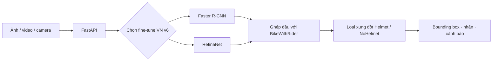

# Phát hiện người điều khiển xe máy không đội mũ bảo hiểm

<p align="center">
  So sánh <strong>Faster R-CNN</strong> và <strong>RetinaNet</strong>, kèm demo ảnh, video và camera.
</p>

<p align="center">
  
  
  
  
  
</p>

## Trạng thái hiện tại

README phân biệt rõ số liệu báo cáo và checkpoint đang hiển thị trên demo:

- **Baseline EdgeVision** là thí nghiệm gốc, dùng cùng split khóa để so sánh công bằng và làm mốc số liệu học thuật.
- **Fine-tune Việt Nam v6** bắt đầu từ checkpoint baseline, học thêm một epoch trên train có bổ sung ảnh Việt Nam đã duyệt. Giao diện hiện chỉ hiển thị hai checkpoint này để kiểm tra trực quan.
- Candidate train gộp 20 epoch được giữ cục bộ để đối chiếu, nhưng không phải bản đang triển khai trên demo.

## Bài toán

Đầu vào là ảnh giao thông. Đầu ra gồm khung giới hạn (*bounding box*), nhãn lớp và độ tin cậy cho ba lớp:

| ID | Lớp | Ý nghĩa |
| ---: | --- | --- |
| 1 | `BikeWithRider` | Xe máy và người đang ngồi trên xe |
| 2 | `NoHelmet` | Vùng đầu không đội mũ bảo hiểm |
| 3 | `Helmet` | Vùng đầu có đội mũ bảo hiểm |



## Dữ liệu và giao thức

Baseline EdgeVision có 2.392 ảnh và 8.275 annotation, chia cố định 1.673 / 360 / 359 cho train / validation / test. Candidate v6 fine-tune một epoch trên train mở rộng gồm **2.126 ảnh** và **7.224 annotation**:

| Nguồn train | Ảnh | Ghi chú |
| --- | ---: | --- |
| EdgeVision train | 1.673 | Split gốc đã khóa |
| Ảnh giao thông Việt Nam đã duyệt | 449 | 417 ảnh Motobike v18, 32 ảnh Helmet/LP v24; tất cả có `review_status=approved` và `annotation_completeness=true` |
| Wikimedia Việt Nam gắn tay | 4 | Bổ sung 10 annotation có provenance/giấy phép theo ảnh |
| **Tổng** | **2.126** | **7.224 annotation** |

| Tập đánh giá khóa | Ảnh | `BikeWithRider` | `NoHelmet` | `Helmet` |
| --- | ---: | ---: | ---: | ---: |
| EdgeVision validation | 360 | 566 | 420 | 250 |
| EdgeVision test | 359 | 566 | 422 | 250 |
| `vn_validation` ngoài train | 118 | 192 | 31 | 188 |

Validation/test EdgeVision được giữ nguyên byte/checksum so với split ban đầu. `vn_validation` được giữ ngoài train và không dùng để chọn checkpoint hoặc threshold. Checkpoint được chọn theo mAP@0.5:0.95 trên EdgeVision validation; threshold theo từng lớp được chọn theo F1 của `NoHelmet` ở IoU 0,5 trên validation. Test chỉ chạy sau khi hoàn tất hai lượt train và chốt checkpoint.

Nguồn dữ liệu bổ sung:

- [Helmet/NoHelmet/LP v24](https://universe.roboflow.com/cdio-zmfmj/helmet-lincense-plate-detection-gevlq/dataset/24), CC BY 4.0; lớp `LP` không dùng.
- [Motobike v18](https://universe.roboflow.com/cdio-zmfmj/motobike-detection/dataset/18), CC BY 4.0.
- [Kho mã nguồn CDIO](https://github.com/ThanhSan97/Helmet-Violation-Detection-Using-YOLO-and-VGG16), dùng để đối chiếu nguồn công bố.
- Ảnh Wikimedia Commons có URL, tác giả, giấy phép và checksum trong `data/challenge/metadata/sources_manifest.csv`.

## Kết quả baseline EdgeVision

Hai baseline được train 20 epoch trên GPU **NVIDIA GeForce RTX 2050**, `batch_size=1`, ảnh 512–768 px và trọng số khởi tạo Torchvision `DEFAULT`.

| Mô hình | Best epoch | Test mAP@0.5:0.95 ↑ | Test mAP@0.5 ↑ | Test mAP@0.75 ↑ | AP@0.5:0.95 `NoHelmet` ↑ | Latency validation ↓ | FPS validation ↑ |
| --- | ---: | ---: | ---: | ---: | ---: | ---: | ---: |
| Faster R-CNN | 9 | 0.6562 | 0.9070 | 0.7400 | 0.5584 | 163,59 ms | 6,11 |
| RetinaNet | 8 | 0.6472 | 0.8990 | 0.7457 | 0.5386 | 75,24 ms | 13,29 |

Faster R-CNN cao hơn RetinaNet 0,0090 mAP@0.5:0.95 trong lần chạy này. RetinaNet có latency thấp hơn khoảng 2,17 lần. Các kết luận chỉ áp dụng cho split, cấu hình và RTX 2050 nêu trên.

Benchmark dùng 20 ảnh warm-up và 100 ảnh validation, batch size 1. Thời gian gồm chuyển tensor lên GPU, transform/NMS nội bộ và inference; không gồm đọc ảnh từ ổ đĩa hoặc render giao diện.

### Fine-tune Việt Nam v6

Mỗi candidate bắt đầu từ `best_map.pth` baseline tương ứng, đóng băng backbone và fine-tune một epoch với learning rate `2.5e-5`. Bảng dưới là validation EdgeVision khóa.

| Candidate | Val mAP@0.5:0.95 | Val mAP@0.5 | AP `NoHelmet` |
| --- | ---: | ---: | ---: |
| Faster R-CNN v6 | 0.6512 | 0.9160 | 0.5219 |
| RetinaNet v6 | 0.6404 | 0.9059 | 0.5096 |

Candidate v6 chưa vượt baseline định lượng trên validation; việc hiển thị chúng trên demo chỉ phục vụ kiểm tra trực quan. Sau khi chốt v6 cho demo, nhóm chạy một lượt evaluation trên EdgeVision test chỉ để lưu artifact so sánh, không dùng kết quả này để điều chỉnh checkpoint hoặc threshold.

| Candidate v6 trên EdgeVision test | mAP@0.5:0.95 | mAP@0.5 | AP@0.5:0.95 `NoHelmet` |
| --- | ---: | ---: | ---: |
| Faster R-CNN | 0.6604 | 0.9072 | 0.5598 |
| RetinaNet | 0.6508 | 0.9049 | 0.5405 |

## Demo

| Faster R-CNN fine-tune VN v6 | RetinaNet fine-tune VN v6 |
| --- | --- |
|  |  |

Giao diện hỗ trợ ảnh JPG/JPEG/PNG, video MP4/MOV/AVI tối đa 200 MB và 5 phút, cùng camera snapshot. Video xử lý nối tiếp từng frame; không được xem là camera thời gian thực.

Hậu xử lý ghép vùng đầu với `BikeWithRider`, loại xung đột `Helmet`/`NoHelmet` và chỉ tạo cảnh báo khi ghép đủ rõ. Nhãn “Không xác định” không hiển thị trên ảnh hoặc giao diện.

| Mô hình | `BikeWithRider` | `NoHelmet` | `Helmet` |
| --- | ---: | ---: | ---: |
| Faster R-CNN fine-tune VN v6 | 0.95 | 0.65 | 0.70 |
| RetinaNet fine-tune VN v6 | 0.65 | 0.40 | 0.40 |

Các threshold v6 kế thừa từ baseline để kiểm tra trực quan, chưa được tối ưu riêng cho candidate.

## Cài đặt và chạy

### Môi trường

```powershell
powershell -ExecutionPolicy Bypass -File .\tools\setup_environment.ps1 -InstallMode gpu
.\.venv\Scripts\python.exe .\tools\check_environment.py
```

Xem thêm tại [`HUONG_DAN_CAI_DAT.md`](HUONG_DAN_CAI_DAT.md).

### Checkpoint demo

```text
outputs/
└── vietnam_pilot_v6_wikimedia/
    ├── faster_rcnn/stage1/checkpoints/best_map.pth
    └── retinanet/stage1/checkpoints/best_map.pth
```

| Mô hình | Checkpoint | SHA-256 |
| --- | --- | --- |
| Faster R-CNN fine-tune VN v6 | `outputs/vietnam_pilot_v6_wikimedia/faster_rcnn/stage1/checkpoints/best_map.pth` | `6869faff03a30c497fd60d1a61ef624ae2cc41e261b55030efd8816a980f8348` |
| RetinaNet fine-tune VN v6 | `outputs/vietnam_pilot_v6_wikimedia/retinanet/stage1/checkpoints/best_map.pth` | `d02de4c3a4e76bb4a7898ff8ca04f40104085696532e60a1521f6fa08650263b` |

Dataset, checkpoint, log và artifact sinh tự động không được đưa vào Git. Khi bàn giao, đối chiếu SHA-256 và manifest cục bộ.

### Chạy demo

Mở hai cửa sổ PowerShell tại thư mục dự án.

```powershell
# Cửa sổ 1
.\.venv\Scripts\python.exe -m uvicorn app.api:app --host 127.0.0.1 --port 8000
```

```powershell
# Cửa sổ 2
Set-Location .\frontend
npm ci
npm run dev
```

Mở `http://127.0.0.1:5173/`.

## Tái lập fine-tune Việt Nam v6

```powershell
# Smoke test
python -m src.train --config configs\vietnam_v6_wikimedia_faster_rcnn.yaml --smoke-test --device cuda
python -m src.train --config configs\vietnam_v6_wikimedia_retinanet.yaml --smoke-test --device cuda

# Fine-tune một epoch từ checkpoint baseline, chạy tuần tự trên GPU 4 GB
python -m src.train --config configs\vietnam_v6_wikimedia_faster_rcnn.yaml --device cuda
python -m src.train --config configs\vietnam_v6_wikimedia_retinanet.yaml --device cuda
```

## Kiểm thử

```powershell
.\.venv\Scripts\python.exe -m pytest
Set-Location .\frontend
npm run build
```

## Giới hạn

- Kết quả test chính chỉ có ý nghĩa với EdgeVision test 359 ảnh đã khóa.
- Fine-tune VN v6 chưa vượt baseline trên validation; kết quả test v6 chỉ là lượt đánh giá sau khi chốt candidate, không dùng để tinh chỉnh.
- Benchmark là batch size 1 trên RTX 2050; không phải cam kết thời gian thực cho mọi thiết bị.
- Hệ thống dùng cho học tập/minh họa; cần con người kiểm tra trước khi áp dụng cho giám sát hoặc xử phạt.

## Tài liệu liên quan

- [`configs/README.md`](configs/README.md): cấu hình thí nghiệm.
- [`app/README.md`](app/README.md): backend và model demo.
- [`frontend/README.md`](frontend/README.md): phát triển frontend.
- [`report/2.1.2_huan_luyen_va_danh_gia.md`](report/2.1.2_huan_luyen_va_danh_gia.md): phương pháp huấn luyện và đánh giá.
