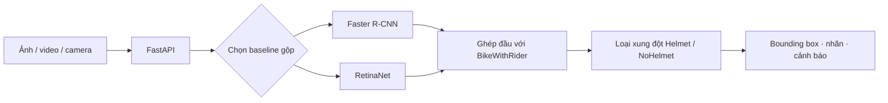
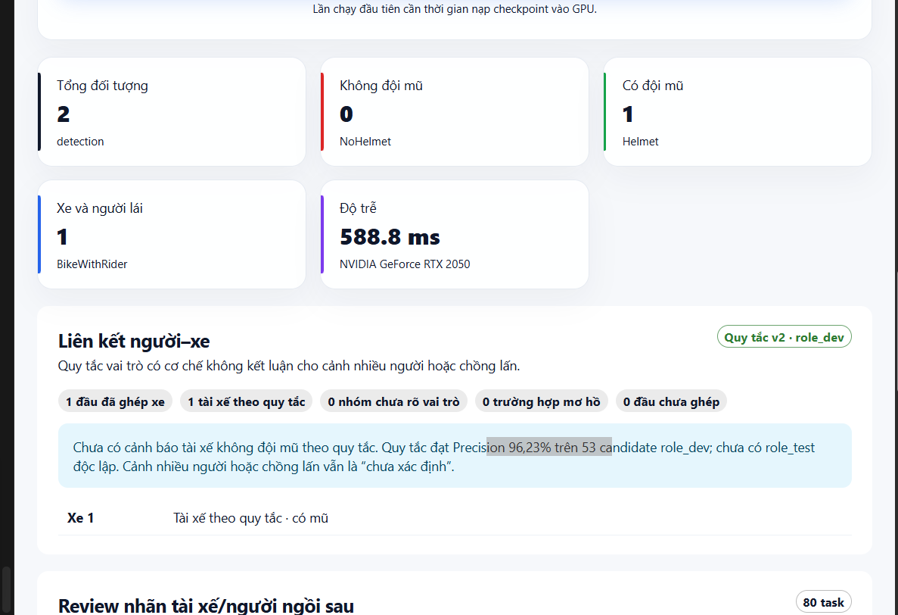
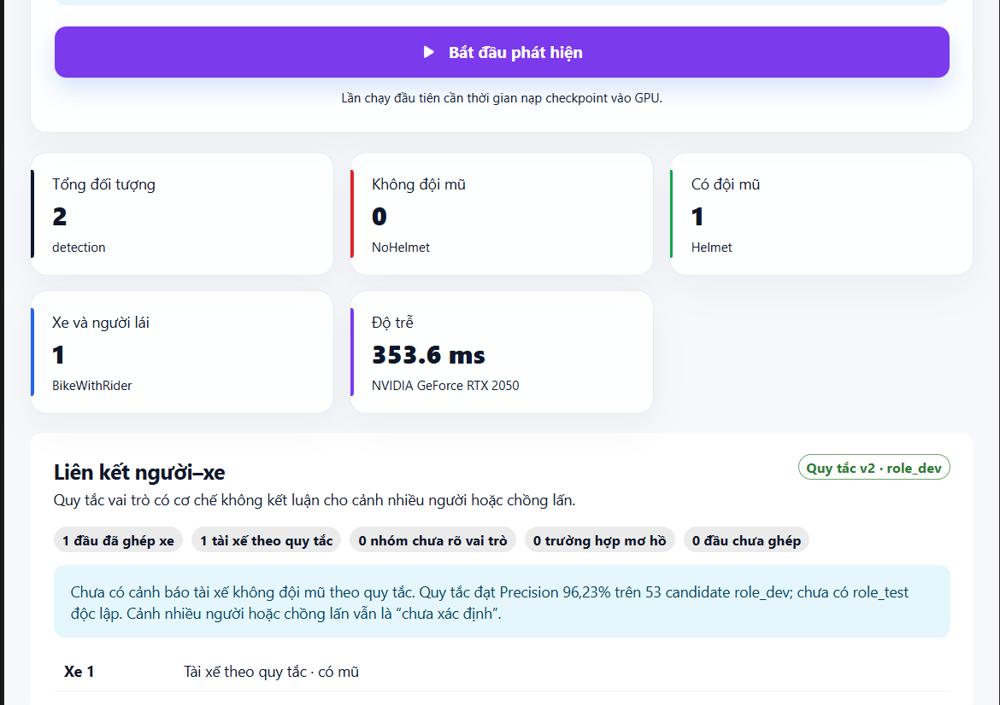

# Phát hiện người điều khiển xe máy không đội mũ bảo hiểm

<p align="center">
  So sánh <strong>Faster R-CNN</strong> và <strong>RetinaNet</strong> trên cùng bộ dữ liệu gộp, kèm demo ảnh, video và camera.
</p>

<p align="center">
  
  
  
  
  
</p>

## Trạng thái hiện tại

Kết quả chính của dự án là **baseline gộp hoàn chỉnh**: Faster R-CNN và RetinaNet đều được train 20 epoch từ cùng cách khởi tạo Torchvision, trên cùng tập train gộp EdgeVision và ảnh giao thông Việt Nam đã duyệt. Cả hai dùng cùng validation/test EdgeVision đã khóa, cùng mapping lớp, cùng evaluator và cùng benchmark.

Giao diện chỉ hiển thị hai checkpoint baseline gộp. Checkpoint EdgeVision cũ và candidate v6 trước đó vẫn nằm cục bộ để rollback, nhưng không phải kết quả chính và không xuất hiện trên giao diện.

## Bài toán

Đầu vào là ảnh giao thông. Đầu ra gồm khung giới hạn (*bounding box*), nhãn lớp và độ tin cậy cho ba lớp:

| ID | Lớp | Ý nghĩa |
| ---: | --- | --- |
| 1 | `BikeWithRider` | Xe máy và người đang ngồi trên xe |
| 2 | `NoHelmet` | Vùng đầu không đội mũ bảo hiểm |
| 3 | `Helmet` | Vùng đầu có đội mũ bảo hiểm |



## Dữ liệu và giao thức

Tập train gộp gồm **2.126 ảnh** và **7.224 annotation**:

| Nguồn train | Ảnh | Ghi chú |
| --- | ---: | --- |
| EdgeVision train | 1.673 | Split gốc đã khóa |
| Ảnh giao thông Việt Nam đã duyệt | 449 | 417 ảnh Motobike v18, 32 ảnh Helmet/LP v24; tất cả có `review_status=approved` và `annotation_completeness=true` |
| Wikimedia Việt Nam gắn tay | 4 | Bổ sung 10 annotation có provenance/giấy phép theo ảnh |
| **Tổng** | **2.126** | **7.224 annotation** |

| Tập đánh giá khóa | Ảnh | `BikeWithRider` | `NoHelmet` | `Helmet` |
| --- | ---: | ---: | ---: | ---: |
| EdgeVision validation | 360 | 566 | 420 | 250 |
| EdgeVision test | 359 | 566 | 422 | 250 |
| `vn_validation` ngoài train | 118 | 192 | 31 | 188 |

Validation/test EdgeVision được giữ nguyên byte/checksum so với split ban đầu. `vn_validation` được giữ ngoài train và không dùng để chọn checkpoint hoặc threshold. Checkpoint được chọn theo mAP@0.5:0.95 trên EdgeVision validation; threshold theo từng lớp được chọn theo F1 của `NoHelmet` ở IoU 0,5 trên validation. Test chỉ chạy sau khi hoàn tất hai lượt train và chốt checkpoint.

Nguồn dữ liệu bổ sung:

- [Helmet/NoHelmet/LP v24](https://universe.roboflow.com/cdio-zmfmj/helmet-lincense-plate-detection-gevlq/dataset/24), CC BY 4.0; lớp `LP` không dùng.
- [Motobike v18](https://universe.roboflow.com/cdio-zmfmj/motobike-detection/dataset/18), CC BY 4.0.
- [Kho mã nguồn CDIO](https://github.com/ThanhSan97/Helmet-Violation-Detection-Using-YOLO-and-VGG16), dùng để đối chiếu nguồn công bố.
- Ảnh Wikimedia Commons có URL, tác giả, giấy phép và checksum trong `data/challenge/metadata/sources_manifest.csv`.

## Kết quả baseline gộp

Hai model được train 20 epoch trên GPU **NVIDIA GeForce RTX 2050**, `batch_size=1`, ảnh 512–768 px, AMP, SGD, augmentation horizontal flip 0,5, không dùng weighted sampling hoặc color jitter mạnh.

| Mô hình | Best epoch | Test mAP@0.5:0.95 ↑ | Test mAP@0.5 ↑ | Test mAP@0.75 ↑ | AP `NoHelmet` ↑ | Latency validation ↓ | FPS validation ↑ |
| --- | ---: | ---: | ---: | ---: | ---: | ---: | ---: |
| Faster R-CNN | 8 | 0.6599 | 0.9078 | 0.7581 | 0.5613 | 162,70 ms | 6,15 |
| RetinaNet | 8 | 0.6425 | 0.8965 | 0.7276 | 0.5325 | 72,25 ms | 13,84 |

Faster R-CNN cao hơn RetinaNet 0,0174 mAP@0.5:0.95 và 0,0289 AP `NoHelmet` trong lần chạy này. RetinaNet có latency thấp hơn khoảng 2,25 lần. Các kết luận chỉ áp dụng cho split, cấu hình và RTX 2050 nêu trên.

Benchmark dùng 20 ảnh warm-up và 100 ảnh validation, batch size 1. Thời gian gồm chuyển tensor lên GPU, transform/NMS nội bộ và inference; không gồm đọc ảnh từ ổ đĩa hoặc render giao diện.

### Kiểm tra ngoài train trên ảnh Việt Nam

`vn_validation` không phải tập test chính thức; bảng này là kiểm tra bổ sung trên 118 ảnh Việt Nam đã tách khỏi train.

| Mô hình | mAP@0.5:0.95 | mAP@0.5 | AP `NoHelmet` | AP `Helmet` |
| --- | ---: | ---: | ---: | ---: |
| Faster R-CNN | 0.8023 | 0.8814 | 0.7076 | 0.7443 |
| RetinaNet | 0.8136 | 0.9055 | 0.7363 | 0.7754 |

Tập này còn nhỏ, đặc biệt chỉ có 31 box `NoHelmet`, nên không thể suy rộng thành khẳng định chất lượng trên mọi camera giao thông Việt Nam.

## Demo

| Faster R-CNN baseline gộp | RetinaNet baseline gộp |
| --- | --- |
|  |  |

Giao diện hỗ trợ ảnh JPG/JPEG/PNG, video MP4/MOV/AVI tối đa 200 MB và 5 phút, cùng camera snapshot. Video xử lý nối tiếp từng frame; không được xem là camera thời gian thực.

Hậu xử lý ghép vùng đầu với `BikeWithRider`, loại xung đột `Helmet`/`NoHelmet` và chỉ tạo cảnh báo khi ghép đủ rõ. Nhãn “Không xác định” không hiển thị trên ảnh hoặc giao diện.

| Mô hình | `BikeWithRider` | `NoHelmet` | `Helmet` |
| --- | ---: | ---: | ---: |
| Faster R-CNN baseline gộp | 0.80 | 0.70 | 0.65 |
| RetinaNet baseline gộp | 0.60 | 0.55 | 0.60 |

Các threshold trên được chọn trên EdgeVision validation, không dùng test.

## Cài đặt và chạy

### Môi trường

```powershell
powershell -ExecutionPolicy Bypass -File .\tools\setup_environment.ps1 -InstallMode gpu
.\.venv\Scripts\python.exe .\tools\check_environment.py
```

Xem thêm tại [`HUONG_DAN_CAI_DAT.md`](HUONG_DAN_CAI_DAT.md).

### Checkpoint demo

```text
outputs/
└── final_combined/
    ├── faster_rcnn/checkpoints/best_map.pth
    └── retinanet/checkpoints/best_map.pth
```

| Mô hình | Checkpoint | SHA-256 |
| --- | --- | --- |
| Faster R-CNN baseline gộp | `outputs/final_combined/faster_rcnn/checkpoints/best_map.pth` | `e81f73ba8cfe46b543d9141e211d4922548e07f7429ba523a70d228808997f55` |
| RetinaNet baseline gộp | `outputs/final_combined/retinanet/checkpoints/best_map.pth` | `f93c48cbf1c9cf4afcc25d7d2fafb767040c9cdb412c6ac170ffaf1f72951f1f` |

Dataset, checkpoint, log và artifact sinh tự động không được đưa vào Git. Khi bàn giao, đối chiếu SHA-256 và manifest cục bộ.

### Chạy demo

Mở hai cửa sổ PowerShell tại thư mục dự án.

```powershell
# Cửa sổ 1
.\.venv\Scripts\python.exe -m uvicorn app.api:app --host 127.0.0.1 --port 8000
```

```powershell
# Cửa sổ 2
Set-Location .\frontend
npm ci
npm run dev
```

Mở `http://127.0.0.1:5173/`.

## Tái lập baseline gộp

```powershell
# Smoke test
python -m src.train --config configs\final_combined_faster_rcnn.yaml --smoke-test --device cuda
python -m src.train --config configs\final_combined_retinanet.yaml --smoke-test --device cuda

# Train 20 epoch mỗi model, chạy tuần tự trên GPU 4 GB
python -m src.train --config configs\final_combined_faster_rcnn.yaml --device cuda
python -m src.train --config configs\final_combined_retinanet.yaml --device cuda

# Chọn threshold trên validation
python -m src.threshold_selection --config configs\final_combined_faster_rcnn.yaml --checkpoint outputs\final_combined\faster_rcnn\checkpoints\best_map.pth --output outputs\final_combined\faster_rcnn\metrics\validation_threshold_selection.json --target-class NoHelmet --device cuda
python -m src.threshold_selection --config configs\final_combined_retinanet.yaml --checkpoint outputs\final_combined\retinanet\checkpoints\best_map.pth --output outputs\final_combined\retinanet\metrics\validation_threshold_selection.json --target-class NoHelmet --device cuda

# Đánh giá test sau khi chốt checkpoint/threshold
python -m src.evaluate --config configs\final_combined_faster_rcnn.yaml --split test --checkpoint outputs\final_combined\faster_rcnn\checkpoints\best_map.pth --output outputs\final_combined\faster_rcnn\metrics\test_metrics.json --device cuda
python -m src.evaluate --config configs\final_combined_retinanet.yaml --split test --checkpoint outputs\final_combined\retinanet\checkpoints\best_map.pth --output outputs\final_combined\retinanet\metrics\test_metrics.json --device cuda
```

## Kiểm thử

```powershell
.\.venv\Scripts\python.exe -m pytest
Set-Location .\frontend
npm run build
```

## Giới hạn

- Kết quả test chính chỉ có ý nghĩa với EdgeVision test 359 ảnh đã khóa.
- `vn_validation` nhỏ và không phải benchmark độc lập hoàn toàn với mọi nguồn dữ liệu Việt Nam.
- Benchmark là batch size 1 trên RTX 2050; không phải cam kết thời gian thực cho mọi thiết bị.
- Hệ thống dùng cho học tập/minh họa; cần con người kiểm tra trước khi áp dụng cho giám sát hoặc xử phạt.

## Tài liệu liên quan

- [`configs/README.md`](configs/README.md): cấu hình thí nghiệm.
- [`app/README.md`](app/README.md): backend và model demo.
- [`frontend/README.md`](frontend/README.md): phát triển frontend.
- [`report/2.1.2_huan_luyen_va_danh_gia.md`](report/2.1.2_huan_luyen_va_danh_gia.md): phương pháp huấn luyện và đánh giá.
