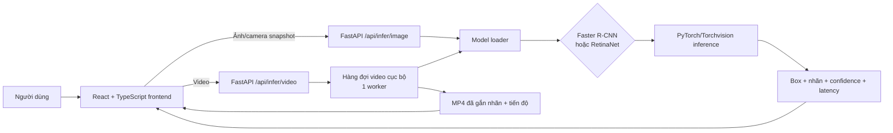

# Gói thông tin hoàn thiện Chương 2 — Xây dựng ứng dụng phát hiện đối tượng

## Phạm vi và cách dùng

- **Mục đích:** tổng hợp các thông tin đã có bằng artifact thực nghiệm để nhóm viết thống nhất Chương 2; không dùng tài liệu này để thay thế cho log, JSON hay cấu hình gốc.
- **Nguồn phân công:** `C:\Users\choqu\OneDrive\Desktop\Phân chia CV_AI.docx`.
- **Phạm vi kỹ thuật:** so sánh Faster R-CNN và RetinaNet trong phát hiện ba lớp `BikeWithRider`, `NoHelmet`, `Helmet` từ ảnh giao thông.
- **Không đưa vào chương chính:** quy tắc liên kết vai trò người–xe v2 và màn hình review nhãn. Đây là thử nghiệm mở rộng, không phải tiêu chí so sánh hai detector.
- **Lưu ý:** tên công bố, đường dẫn và giấy phép chính thức của EdgeVision chưa được xác minh; chỉ ghi “EdgeVision” trong bản nháp và để placeholder trích dẫn cho đến khi có nguồn chính thức.

---

## 1. Bản đồ phân công của Chương 2

| Mục | Người phụ trách theo phân công | Nội dung cần bàn giao cho bản báo cáo |
|---|---|---|
| 2.1.1 Chuẩn hóa và tiền xử lý dữ liệu | Sinh | Quy trình kiểm tra annotation, làm sạch, chuyển về COCO/Torchvision, augmentation và split. |
| 2.1.2 Huấn luyện và đánh giá | Long | Fine-tune, IoU/Precision/Recall/mAP, giao thức đánh giá công bằng, benchmark và diễn giải kết quả. |
| 2.2.1 Khảo sát hệ thống nhận diện | Thao | Mô tả luồng người dùng đưa ảnh/video/camera vào và nhận kết quả. |
| 2.2.2 Phân tích thiết kế ứng dụng | Thành | Use-case hoặc Data Flow Diagram; mô tả thành phần frontend, API, inference và lưu video kết quả. |
| 2.3 Thực hiện bài toán | Tùng, Thao, Sinh, Thành, Long | Mỗi người mô tả phần code/artefact mình thực hiện, không lặp lại lý thuyết Chương 1. |
| 2.4 Kết luận | Tùng, Sinh | Bảng tổng hợp đã làm, nhận xét có căn cứ và hướng phát triển. |

**Nguyên tắc ghép chương:** Long có thể tổng hợp kỹ thuật và demo, nhưng không nhận nhầm phần “viết script metric” của Thành, “làm sạch dữ liệu” của Tùng/Sinh hoặc “fine-tune” của Thao/Sinh.

---

## 2. Thông tin dùng chung cho toàn Chương 2

### 2.1. Bài toán và đầu ra

Đề tài được thực hiện như một bài toán phát hiện đối tượng. Với mỗi ảnh đầu vào, hệ thống trả về một tập dự đoán gồm: khung giới hạn `bounding box`, nhãn lớp và độ tin cậy `confidence score`. Ba lớp của dữ liệu đã xử lý là:

| ID | Nhãn kỹ thuật | Cách diễn đạt khuyến nghị trong báo cáo |
|---:|---|---|
| 1 | `BikeWithRider` | Xe máy có người điều khiển/người ngồi trên xe |
| 2 | `NoHelmet` | Vùng đầu không đội mũ bảo hiểm |
| 3 | `Helmet` | Vùng đầu có đội mũ bảo hiểm |

Điểm cần diễn đạt chính xác: annotation hiện tại phát hiện **xe–người**, **đầu có mũ** và **đầu không mũ**; nó không có nhãn tài xế/người ngồi sau riêng. Vì vậy, kết quả cốt lõi của đề tài là phát hiện các đối tượng trên, không khẳng định chắc chắn từng box `NoHelmet` luôn thuộc người điều khiển trong cảnh nhiều người.

### 2.2. Dataset, kiểm định và chia tập

Tập raw gồm 2.392 ảnh và 8.275 annotation. Báo cáo kiểm định raw phát hiện 1 box không hợp lệ và 78 box vượt biên ảnh. Sau xử lý, annotation được chuẩn hóa thành 2.392 ảnh và **8.274** box hợp lệ; không còn ID trùng, ảnh thiếu/hỏng, box không hợp lệ hoặc box vượt biên.

| Lớp | Số annotation sau xử lý |
|---|---:|
| `BikeWithRider` | 3.793 |
| `NoHelmet` | 2.810 |
| `Helmet` | 1.671 |
| **Tổng** | **8.274** |

Dataset được chia cố định với seed 42 và tỷ lệ 70%/15%/15%:

| Tập | Ảnh | Box | `BikeWithRider` | `NoHelmet` | `Helmet` | Vai trò |
|---|---:|---:|---:|---:|---:|---|
| Train | 1.673 | 5.800 | 2.661 | 1.968 | 1.171 | Cập nhật trọng số |
| Validation | 360 | 1.236 | 566 | 420 | 250 | Chọn checkpoint và threshold demo |
| Test | 359 | 1.238 | 566 | 422 | 250 | Đánh giá cuối cùng |
| **Tổng** | **2.392** | **8.274** | **3.793** | **2.810** | **1.671** | — |

Các hash split đã được đóng băng trong `data/splits/frozen_manifest.json`. Hai mô hình dùng cùng `train.json`, `val.json`, `test.json`; vì vậy không dùng test để chọn epoch hoặc confidence threshold.

### 2.3. Môi trường và cấu hình chung

| Thành phần | Giá trị đã xác minh |
|---|---|
| Hệ điều hành | Windows 10 |
| CPU | Intel Core i5-12450H |
| GPU | NVIDIA GeForce RTX 2050, 4 GB VRAM |
| RAM | 16 GB |
| Python | 3.11.9 |
| PyTorch / Torchvision | 2.5.1+cu121 / 0.20.1+cu121 |
| CUDA runtime | 12.1 |
| Định dạng annotation | COCO; box được chuyển thành `xyxy` khi đưa vào model/evaluator |
| Kích thước ảnh | cạnh ngắn 512 px, cạnh dài tối đa 768 px |
| Augmentation | lật ngang ngẫu nhiên, xác suất 0,5 ở train |
| Seed | 42 |

---

## 3. Nội dung sẵn sàng cho từng mục

## 3.1. Mục 2.1.1 — Chuẩn hóa và tiền xử lý dữ liệu

### Ý chính phải viết

1. Annotation gốc được kiểm định độc lập trước khi train: kiểm tra ID ảnh/annotation/category trùng, ảnh thiếu/hỏng, box sai kích thước, box vượt biên và nhãn không xác định.
2. Box không hợp lệ bị loại và các box vượt biên được hiệu chỉnh/cắt theo biên ảnh trong bản processed; bản raw được giữ nguyên để truy vết.
3. Dữ liệu sau xử lý giữ ba category ID 1–3, phù hợp class mapping chung của Faster R-CNN và RetinaNet.
4. Split cố định seed 42, cùng manifest cho hai model; train có lật ngang ngẫu nhiên, validation/test không augmentation ngẫu nhiên.
5. Không nên nói “cân bằng hoàn toàn dữ liệu”: số box giữa ba lớp vẫn khác nhau; RetinaNet dùng cơ chế Focal Loss bên trong kiến trúc, nhưng phần mô tả tập trung vào dữ liệu và không khẳng định augmentation đã làm cân bằng lớp.

### Artefact để dẫn nguồn

- `outputs/dataset_report.json`: kết quả kiểm tra dữ liệu raw.
- `outputs/dataset_quality/processed_report.json`: kết quả sau chuẩn hóa.
- `data/splits/split_summary.json` và `data/splits/frozen_manifest.json`: thống kê và hash chia tập.
- `configs/common.yaml`: class mapping, kích thước ảnh, augmentation, evaluator chung.

### Hình/bảng cần chèn

- Bảng thống kê lớp và split ở mục 2.2 của tài liệu này.
- Ảnh annotation trước/sau xử lý: **cần Sinh/Tùng xuất ảnh từ** `tools/visualize_annotations.py`.
- Chú thích ảnh phải ghi “Nguồn: Nhóm tác giả xây dựng từ EdgeVision đã xử lý”.

## 3.2. Mục 2.1.2 — Huấn luyện và đánh giá (Long)

Bản hoàn chỉnh đã có tại `report_drafts/long_2_1_2_huan_luyen_va_danh_gia.md`. Khi ghép sang Chương 2, giữ nguyên các số liệu sau.

### Fine-tune

| Thuộc tính | Faster R-CNN | RetinaNet |
|---|---|---|
| Biến thể Torchvision | `fasterrcnn_resnet50_fpn_v2` | `retinanet_resnet50_fpn_v2` |
| Trọng số khởi tạo | COCO default | COCO default |
| Số lớp của model | 4, gồm nền nội bộ + 3 lớp đối tượng | 4, gồm nền nội bộ + 3 lớp đối tượng |
| Backbone được fine-tune | 3 tầng cuối | 3 tầng cuối |
| Optimizer | SGD, LR 0,0025, momentum 0,9, weight decay 0,0005 | Như Faster R-CNN |
| Scheduler | StepLR, gamma 0,1, mỗi 7 epoch | Như Faster R-CNN |
| Batch size / epoch | 1 / 20 | 1 / 20 |
| Checkpoint tốt nhất | epoch 9 | epoch 8 |
| Thời gian train 20 epoch | 2 giờ 36 phút 21 giây | 2 giờ 14 phút 44 giây |

### Định nghĩa/giao thức metric cần giữ

- IoU: `|B_pred ∩ B_gt| / |B_pred ∪ B_gt|`.
- TP/FP/FN cho Precision–Recall: greedy one-to-one, sắp prediction theo score giảm dần, cùng lớp, IoU ≥ 0,50.
- AP là diện tích đường Precision–Recall của một lớp; mAP là trung bình AP giữa các lớp.
- mAP@0.5:0.95 là chỉ số chính; mAP@0.5, mAP@0.75 và mAR@100 là chỉ số bổ sung.
- mAP tính theo COCO mAP@[0,50:0,95], bước 0,05, backend `pycocotools`/TorchMetrics.
- Checkpoint chọn bằng validation mAP@0.5:0.95; test chỉ chạy sau khi checkpoint đã chốt.

### Kết quả test chính thức

| Mô hình | mAP@0.5:0.95 | mAP@0.5 | mAP@0.75 | mAR@100 |
|---|---:|---:|---:|---:|
| Faster R-CNN | **0,6562** | **0,9070** | 0,7400 | 0,7317 |
| RetinaNet | 0,6472 | 0,8990 | **0,7457** | **0,7436** |

Phân tích đúng mức: Faster R-CNN cao hơn 0,0090 mAP@0.5:0.95; RetinaNet cao hơn 0,0057 ở mAP@0.75 và 0,0120 ở mAR@100. Đây là xu hướng ở một cấu hình/seed, chưa đủ để tuyên bố một model vượt trội hoàn toàn.

### Lớp `NoHelmet` và threshold demo

| Chỉ số test đầu ra thô, IoU 0,5 | Faster R-CNN | RetinaNet |
|---|---:|---:|
| Precision | 0,6747 | 0,1504 |
| Recall | 0,9336 | **0,9645** |
| AP@0.5:0.95 | **0,5584** | 0,5386 |

Ngưỡng hiển thị demo được quét **trên validation**, không dùng test: Faster R-CNN = 0,85 (F1 lớp `NoHelmet` = 0,8631); RetinaNet = 0,60 (F1 = 0,8216). Không dùng các threshold này để sửa bảng mAP test.

### Benchmark tốc độ

Đo trên 100 ảnh validation, sau 20 ảnh warm-up, batch size 1, RTX 2050. Thời gian gồm chuyển tensor CPU–GPU, transform nội bộ Torchvision, forward, hậu xử lý/NMS; không gồm đọc ảnh từ đĩa, vẽ box hoặc giao diện.

| Mô hình | Mean latency | Median | P95 | FPS | Peak GPU allocated |
|---|---:|---:|---:|---:|---:|
| Faster R-CNN | 163,59 ms | 163,80 ms | 175,64 ms | 6,11 | 475,9 MiB |
| RetinaNet | **75,24 ms** | **75,41 ms** | **83,58 ms** | **13,29** | **376,1 MiB** |

Không gọi hệ thống là “thời gian thực” vì nhóm chưa định nghĩa tiêu chí và benchmark đạt 6,11/13,29 FPS.

### Artefact để dẫn nguồn

- `outputs/faster_rcnn/run_manifest.json`, `outputs/retinanet/run_manifest.json`.
- `outputs/comparison/test_comparison.json`.
- `outputs/*/metrics/test_metrics.json`, `outputs/*/metrics/validation_threshold_selection.json`.
- `outputs/*/metrics/latency_validation.json`.

## 3.3. Mục 2.2.1 — Khảo sát hệ thống nhận diện (Thao)

### Mô tả có thể dùng trực tiếp

Người dùng chọn Faster R-CNN hoặc RetinaNet, chọn chế độ **Hình ảnh**, **Video** hoặc **Camera**, sau đó đưa dữ liệu vào hệ thống. Với ảnh và camera snapshot, frontend gửi tệp lên API suy luận ảnh; backend nạp checkpoint tương ứng, thực hiện suy luận và trả ảnh đã vẽ bounding box, nhãn, confidence, độ trễ và bảng chi tiết detection. Với video, backend tạo một tác vụ nền cục bộ, xử lý tuần tự từng frame để tránh cạnh tranh bộ nhớ GPU, cập nhật tiến độ, tạo MP4 đã gắn nhãn và cho phép phát trực tiếp hoặc tải xuống.

Camera hiện là **chụp một frame rồi suy luận**, không phải luồng camera live liên tục. Video hỗ trợ MP4, MOV, AVI; giới hạn 200 MB và 5 phút. Lần chạy đầu mỗi model có thể chậm do kiểm tra checkpoint và nạp lên GPU.

### Hình cần chèn

- 01 ảnh màn hình mode ảnh với Faster R-CNN.
- 01 ảnh cùng input với RetinaNet để so sánh định tính.
- 01 ảnh/video preview sau khi xử lý video.
- 01 ảnh camera snapshot nếu muốn chứng minh mode camera.

Không dùng ảnh màn hình review nhãn hay liên kết người–xe v2 vì đã được bỏ khỏi giao diện chính.

## 3.4. Mục 2.2.2 — Phân tích thiết kế ứng dụng (Thành)

### Kiến trúc đã triển khai

### Use-case tối thiểu

| Tác nhân | Use-case |
|---|---|
| Người dùng | Chọn model; chọn mode; tải ảnh/video; mở/chụp camera; đặt confidence threshold; bắt đầu suy luận; xem box/chỉ số; phát/tải video kết quả. |
| Hệ thống | Kiểm tra trạng thái backend và checkpoint; từ chối tệp sai định dạng; chạy inference; lưu/tạo video kết quả; báo lỗi và tiến độ. |

### Thành phần và tệp tương ứng

| Tầng | Trách nhiệm | Tệp chính |
|---|---|---|
| UI | mode, upload, preview, kết quả và error state | `frontend/src/App.tsx` |
| API | health, model catalogue, inference ảnh/video, preview/download video | `app/api.py` |
| Model loader | đọc config, xác minh checkpoint, nạp đúng model | `app/model_loader.py` |
| Inference | lọc theo confidence, tạo record, vẽ detection | `src/infer.py` |
| Video worker | xử lý tuần tự từng frame, progress, MP4 output | `app/video_jobs.py` |

## 3.5. Mục 2.3 — Thực hiện bài toán

Nên chia thành các tiểu mục ngắn theo artefact thật để tránh biến 2.3 thành phần lý thuyết lặp lại Chương 1.

| Tiểu mục gợi ý | Nội dung cần trình bày | Minh chứng nên chèn | Người phụ trách |
|---|---|---|---|
| 2.3.1 Chuẩn bị dữ liệu | kiểm định COCO, xử lý box lỗi, split frozen, DataLoader/augmentation | bảng dữ liệu; 1–2 ảnh annotation | Tùng/Sinh |
| 2.3.2 Fine-tune Faster R-CNN | config, thay predictor 4 lớp, log train, checkpoint epoch 9 | config/loss curve, log rút gọn | Thao |
| 2.3.3 Fine-tune RetinaNet | config, classification head 4 lớp, Focal Loss có sẵn trong Torchvision, checkpoint epoch 8 | config/loss curve, log rút gọn | Sinh |
| 2.3.4 Đánh giá và so sánh | evaluator chung, test JSON, bảng metric, benchmark | bảng mAP + biểu đồ latency/FPS | Thành phối hợp Long |
| 2.3.5 Tích hợp demo | React–FastAPI, model selection, ảnh/video/camera snapshot, output | ảnh giao diện mới, không có v2 | Long |

## 3.6. Mục 2.4 — Kết luận và hướng phát triển

### Nội dung đã thực hiện

- Chuẩn hóa và kiểm định 2.392 ảnh EdgeVision, đóng băng split dùng chung.
- Fine-tune hai model Torchvision trên cùng cấu hình dữ liệu chính.
- Đánh giá trên test bằng một giao thức chung, xuất metric so sánh và benchmark GPU.
- Xây dựng demo có chọn model, ảnh, video và camera snapshot.

### Nhận xét có thể dùng

Trên cấu hình hiện tại, Faster R-CNN nhỉnh hơn nhẹ ở mAP@0.5:0.95, còn RetinaNet nhanh hơn đáng kể và dùng ít bộ nhớ GPU cấp phát đỉnh hơn. Vì chênh lệch độ chính xác nhỏ và chỉ có một seed, báo cáo không nên kết luận tuyệt đối model nào tốt hơn. Việc lựa chọn phụ thuộc ưu tiên triển khai: chất lượng mAP tổng quát hay tốc độ/tài nguyên.

### Hướng phát triển đúng phạm vi

1. Lặp lại với nhiều seed hoặc bổ sung dữ liệu khó để đánh giá độ ổn định.
2. Bổ sung ảnh giao thông Việt Nam đa dạng về ánh sáng, góc chụp, che khuất, mật độ xe và loại mũ.
3. Tối ưu triển khai bằng model nhẹ hơn, quantization hoặc TensorRT/ONNX nếu có yêu cầu thiết bị yếu.
4. Nếu cần kết luận chính xác “tài xế không đội mũ”, phải xây dựng nhãn vai trò tài xế/người ngồi sau riêng và thiết kế giao thức đánh giá độc lập; không dùng như kết quả chính của báo cáo hiện tại.

---

## 4. Danh sách còn thiếu trước khi nộp

| Mức độ | Việc cần xác nhận/bổ sung | Người nên cung cấp |
|---|---|---|
| Bắt buộc | Tên công bố, URL/DOI và giấy phép EdgeVision để trích dẫn | Tùng/Sinh |
| Bắt buộc | Chuẩn trích dẫn, mẫu đánh số hình/bảng, giới hạn trang của giảng viên | Cả nhóm/Long |
| Bắt buộc | Ảnh chụp giao diện mới: không còn review nhãn và v2 | Long |
| Khuyến nghị | Ảnh annotation trước/sau tiền xử lý | Sinh/Tùng |
| Khuyến nghị | Đoạn log train rút gọn/cấu hình Faster R-CNN và RetinaNet | Thao/Sinh |
| Khuyến nghị | Use-case/DFD được vẽ lại bằng draw.io/Figma/PowerPoint | Thành |
| Tùy chọn | Phân tích FP/FN theo ảnh khó hoặc nhiều seed | Thành/nhóm |

## 5. Tệp nguồn đã kiểm tra

- `outputs/dataset_report.json`, `outputs/dataset_quality/processed_report.json`.
- `data/splits/split_summary.json`, `data/splits/frozen_manifest.json`.
- `outputs/environment.json`, `configs/common.yaml`, `configs/faster_rcnn.yaml`, `configs/retinanet.yaml`.
- `outputs/faster_rcnn/run_manifest.json`, `outputs/retinanet/run_manifest.json`.
- `outputs/comparison/test_comparison.json`.
- `outputs/faster_rcnn/metrics/latency_validation.json`, `outputs/retinanet/metrics/latency_validation.json`.
- `outputs/faster_rcnn/metrics/validation_threshold_selection.json`, `outputs/retinanet/metrics/validation_threshold_selection.json`.
- `frontend/README.md`, `app/api.py`, `app/video_jobs.py`, `frontend/src/App.tsx`.
