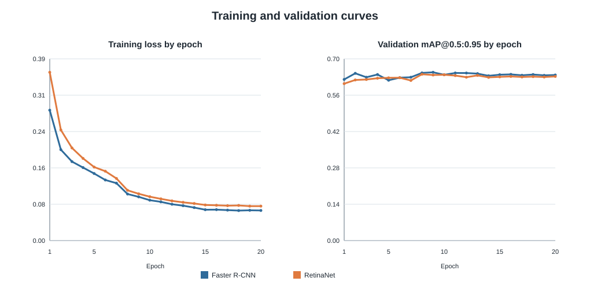
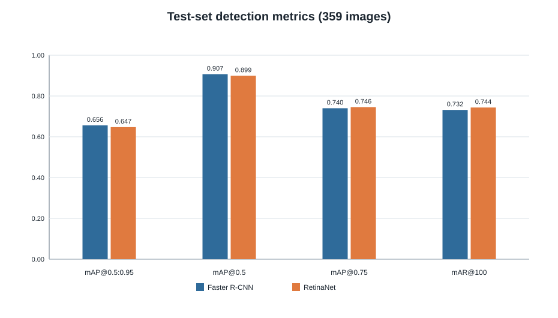
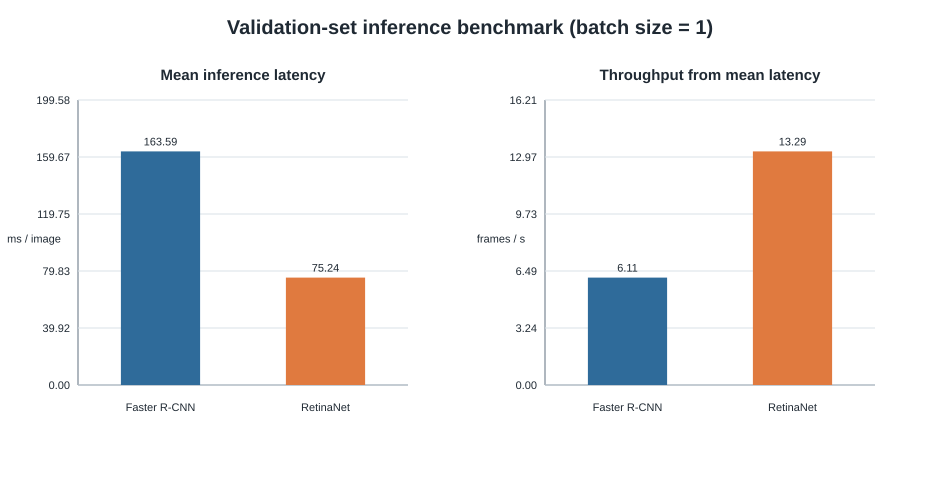
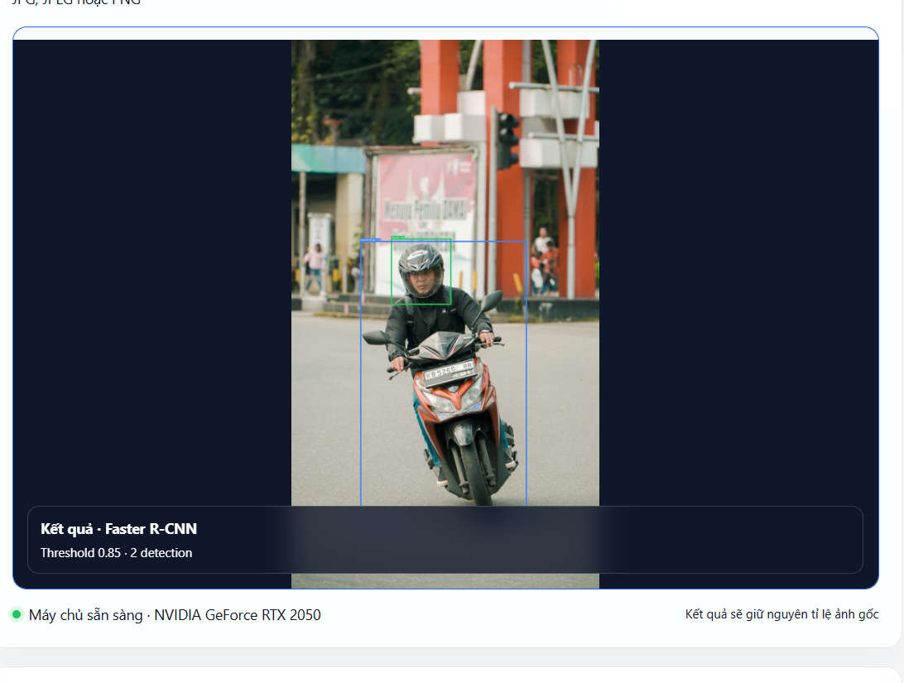
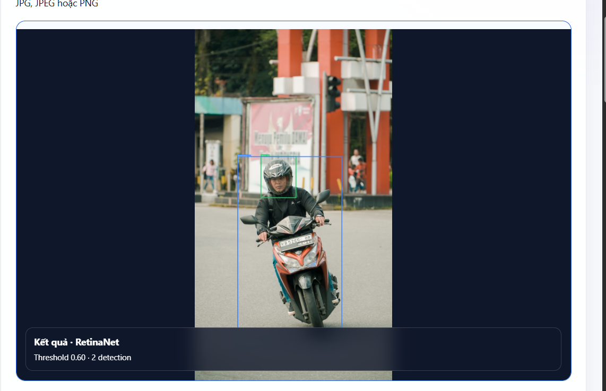
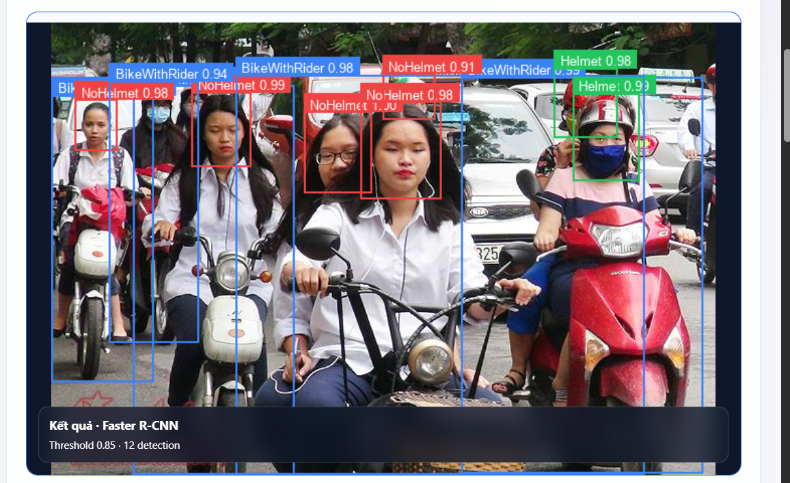
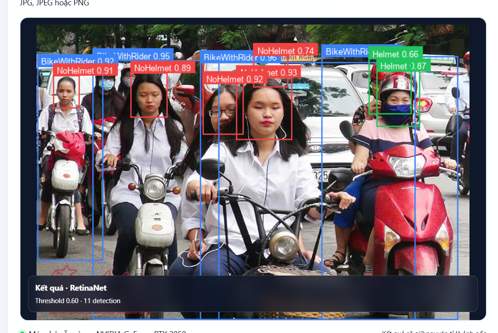

# Bản thảo 2.1.2 — Huấn luyện và đánh giá

## Thông tin bản thảo

- **Phạm vi:** Quy trình fine-tune, giao thức đánh giá và diễn giải kết quả của Faster R-CNN và RetinaNet.
- **Người phụ trách:** Nguyễn Thành Long.
- **Trạng thái:** Bản thảo đã điền số liệu thực nghiệm, ngưỡng demo và ảnh minh họa định tính; chờ nhóm xác nhận chuẩn trích dẫn và vị trí đánh số hình/bảng trong báo cáo tổng thể.
- **Nguồn đầu vào đã sử dụng:** manifest huấn luyện, JSON đánh giá trên test, JSON benchmark suy luận và tệp cấu hình trong kho mã nguồn của nhóm.
- **Giả định và dữ liệu còn thiếu:** Mô tả dưới đây dùng đúng cấu hình đã lưu trong artifact. Chuẩn trình bày tài liệu tham khảo, tên chính thức của nguồn dataset và yêu cầu hình thức của giảng viên chưa được xác nhận.

---

## 2.1.2. Huấn luyện và đánh giá

### Mục đích và nguyên tắc thực nghiệm

Mục này mô tả cách nhóm tinh chỉnh (fine-tune) hai mô hình Faster R-CNN và RetinaNet cho bài toán phát hiện đối tượng trong ảnh giao thông. Mỗi dự đoán gồm khung giới hạn, nhãn lớp và độ tin cậy. Các lớp đối tượng trong dữ liệu đã xử lý là `BikeWithRider`, `NoHelmet` và `Helmet`; lớp nền chỉ được dùng nội bộ bởi mô hình và không được tính là một lớp phát hiện.

Để phép so sánh có ý nghĩa, hai mô hình được huấn luyện từ trọng số khởi tạo cùng loại (trọng số COCO do Torchvision cung cấp), dùng cùng bộ dữ liệu, cùng cách chia tập, cùng quy trình đánh giá và cùng phần cứng. Tập kiểm thử được giữ riêng trong suốt quá trình chọn checkpoint; checkpoint tốt nhất của mỗi mô hình được chọn theo mAP@0.5:0.95 trên tập xác thực, sau đó chỉ đánh giá một lần trên tập kiểm thử. Cách làm này tránh điều chỉnh cấu hình theo kết quả của tập kiểm thử.

### Quy trình fine-tune

#### Chuẩn bị dữ liệu và chia tập

Tập dữ liệu đã được chuyển về định dạng dùng cho Torchvision và cố định bằng seed 42. Toàn bộ 2.392 ảnh chứa 8.274 khung giới hạn, được chia như Bảng 2.x. Cùng một tệp manifest chia tập được dùng cho cả hai mô hình; vì vậy không có ảnh thuộc tập huấn luyện hoặc xác thực xuất hiện trong tập kiểm thử.

**Bảng 2.x. Phân chia dữ liệu dùng trong thực nghiệm.**

| Tập dữ liệu | Số ảnh | Số khung giới hạn | Vai trò |
|---|---:|---:|---|
| Huấn luyện | 1.673 | 5.800 | Cập nhật trọng số mô hình |
| Xác thực | 360 | 1.236 | Theo dõi quá trình huấn luyện và chọn checkpoint |
| Kiểm thử | 359 | 1.238 | Đánh giá cuối cùng, không dùng để chọn cấu hình |
| **Tổng** | **2.392** | **8.274** | — |

#### Cấu hình chung

Faster R-CNN là detector hai giai đoạn, trong khi RetinaNet là detector một giai đoạn có Focal Loss; hai kiến trúc này được mô tả chi tiết trong các công trình gốc của Ren và cộng sự [Ren et al., 2015] và Lin và cộng sự [Lin et al., 2017]. Trong phần thực nghiệm, nhóm sử dụng các biến thể có sẵn trong Torchvision và thay đầu dự đoán để phù hợp với ba lớp đối tượng của bài toán.

Các siêu tham số chính được giữ nhất quán giữa hai lần huấn luyện, trình bày ở Bảng 2.y. Việc dùng batch size bằng 1 là ràng buộc phù hợp với GPU RTX 2050 dung lượng 4 GB. Kích thước ảnh được điều chỉnh trong khoảng cạnh ngắn 512 pixel và cạnh dài tối đa 768 pixel bởi pipeline của Torchvision.

**Bảng 2.y. Cấu hình fine-tune áp dụng cho cả hai mô hình.**

| Thành phần | Giá trị |
|---|---|
| Framework | PyTorch 2.5.1+cu121, Torchvision 0.20.1+cu121 |
| Trọng số khởi tạo | Trọng số COCO mặc định của Torchvision |
| Số lớp đầu ra | 4 gồm 3 lớp đối tượng và lớp nền nội bộ |
| Optimizer | SGD, momentum = 0,9, weight decay = 0,0005 |
| Learning rate ban đầu | 0,0025 |
| Scheduler | StepLR, giảm theo hệ số 0,1 sau mỗi 7 epoch |
| Batch size | 1 |
| Số epoch | 20 |
| Kích thước ảnh | Cạnh ngắn 512, cạnh dài tối đa 768 pixel |
| Backbone được fine-tune | 3 tầng cuối của backbone |
| Seed | 42 |
| Phần cứng | Intel Core i5-12450H, NVIDIA GeForce RTX 2050 4 GB, RAM 16 GB |

Ở mỗi epoch, mô hình nhận ảnh và annotation của tập huấn luyện, tính hàm mất mát, lan truyền ngược và cập nhật trọng số qua SGD. Sau epoch, mô hình được suy luận trên tập xác thực; mAP@0.5:0.95 được dùng làm tiêu chí lưu checkpoint tốt nhất. Loss huấn luyện chỉ phản ánh mục tiêu tối ưu trên tập huấn luyện, nên không được dùng thay cho chỉ số đánh giá tổng quát hóa trên tập xác thực hoặc kiểm thử.

Đường cong ở Hình 2.x là công cụ theo dõi, không phải bằng chứng duy nhất để kết luận mô hình tốt hơn. Checkpoint được chọn và thời gian hoàn thành mỗi lượt huấn luyện được tổng hợp ở Bảng 2.z.

**Bảng 2.z. Thông tin chọn checkpoint sau fine-tune.**

| Mô hình | Epoch của checkpoint tốt nhất theo validation mAP@0.5:0.95 | Thời gian huấn luyện 20 epoch |
|---|---:|---:|
| Faster R-CNN | 9 | 2 giờ 36 phút 21 giây |
| RetinaNet | 8 | 2 giờ 14 phút 44 giây |

### Các chỉ số đánh giá

#### Intersection over Union

Intersection over Union (IoU) đo độ chồng lấp giữa khung dự đoán \(B_p\) và khung nhãn thật \(B_g\):

\[
\operatorname{IoU}(B_p, B_g) = \frac{|B_p \cap B_g|}{|B_p \cup B_g|}.
\]

Trong đó \(|B_p \cap B_g|\) là diện tích giao và \(|B_p \cup B_g|\) là diện tích hợp của hai khung. IoU có giá trị từ 0 đến 1; giá trị cao thể hiện vị trí và kích thước khung dự đoán gần với nhãn thật. Khi tính Precision và Recall trong thực nghiệm này, một dự đoán chỉ có thể khớp với một nhãn thật chưa được ghép, phải cùng lớp và có IoU không nhỏ hơn 0,5.

#### Precision và Recall

Sau khi sắp xếp dự đoán theo độ tin cậy giảm dần, phép ghép một-một tham lam (greedy matching) được thực hiện trong từng lớp. Với ngưỡng IoU = 0,5:

- **True Positive (TP):** dự đoán có đúng lớp và ghép được với một nhãn thật chưa ghép.
- **False Positive (FP):** dự đoán sai lớp, có IoU dưới ngưỡng, hoặc trùng với nhãn thật đã được ghép.
- **False Negative (FN):** nhãn thật không được bất kỳ dự đoán nào ghép.

Precision và Recall được tính như sau:

\[
\operatorname{Precision} = \frac{TP}{TP + FP},
\qquad
\operatorname{Recall} = \frac{TP}{TP + FN}.
\]

Precision cao cho biết các khung đã dự đoán có ít báo động sai hơn; Recall cao cho biết mô hình bỏ sót ít đối tượng hơn. Hai chỉ số thường đánh đổi với nhau khi thay đổi ngưỡng confidence. Vì vậy, trong báo cáo cần luôn nêu rõ ngưỡng IoU và ngưỡng confidence đi kèm.

Ở Bảng 2.aa, Precision và Recall được lấy từ toàn bộ dự đoán sau ngưỡng nội bộ của mô hình, không áp đặt thêm ngưỡng confidence ở evaluator (`confidence_threshold = null`). Các số này phục vụ phân tích đầu ra thô, không phải ngưỡng đã tối ưu cho giao diện demo. Nếu ứng dụng cần đặt ngưỡng hiển thị, ngưỡng đó phải được chọn trên tập xác thực và ghi rõ riêng.

#### Lựa chọn confidence threshold cho ứng dụng demo

Để tránh điều chỉnh theo tập kiểm thử, nhóm quét các confidence threshold từ 0,05 đến 0,95 với bước 0,05 trên 360 ảnh của tập xác thực. Tiêu chí lựa chọn là F1 của lớp `NoHelmet`; khi các ngưỡng có cùng F1, lần lượt ưu tiên Recall, Precision và ngưỡng cao hơn. Theo giao thức này, ngưỡng dùng cho demo là **0,85** với Faster R-CNN (F1 = 0,8631; Precision = 0,8869; Recall = 0,8405) và **0,60** với RetinaNet (F1 = 0,8216; Precision = 0,8697; Recall = 0,7786). Các ngưỡng này chỉ phục vụ lọc dự đoán khi hiển thị trong demo; chúng không làm thay đổi mAP đã báo cáo và không được chọn từ dữ liệu test.

#### AP và mAP

Average Precision (AP) là diện tích dưới đường Precision–Recall của một lớp tại một quy tắc IoU xác định. Mean Average Precision (mAP) là trung bình AP trên các lớp. Bộ đánh giá COCO còn dùng mAP@0.5:0.95, tức trung bình AP tại các ngưỡng IoU từ 0,50 đến 0,95 với bước 0,05 [Lin et al., 2014]. Trong mục này:

- `mAP@0.5:0.95` là chỉ số chính, khắt khe hơn vì yêu cầu định vị chính xác ở nhiều ngưỡng IoU.
- `mAP@0.5` dùng ngưỡng IoU = 0,50, cho phép quan sát chất lượng phát hiện ở điều kiện ít khắt khe hơn.
- `mAP@0.75` cho thấy chất lượng tại yêu cầu định vị chặt hơn.
- `mAR@100` là mean average recall khi tối đa 100 dự đoán được xét trên mỗi ảnh.

### Kết quả đánh giá trên tập kiểm thử

Sau khi chốt checkpoint từ validation, mỗi mô hình được đánh giá một lần trên cùng 359 ảnh của tập kiểm thử. Giao thức dùng COCO mAP@[0.50:0.95] cho AP/mAP và greedy matching, cùng lớp, IoU = 0,50 cho Precision/Recall. So sánh manifest xác nhận hai lần đánh giá tương thích: cùng tập test, cùng cấu hình đánh giá, cùng batch size và cùng seed.

**Bảng 2.ab. Kết quả phát hiện trên tập kiểm thử (359 ảnh). Giá trị cao hơn tốt hơn.**

| Mô hình | mAP@0.5:0.95 | mAP@0.5 | mAP@0.75 | mAR@100 |
|---|---:|---:|---:|---:|
| Faster R-CNN | **0,6562** | **0,9070** | 0,7400 | 0,7317 |
| RetinaNet | 0,6472 | 0,8990 | **0,7457** | **0,7436** |

Faster R-CNN đạt mAP@0.5:0.95 cao hơn RetinaNet 0,0090 điểm, tương đương khoảng 0,9 điểm phần trăm, và mAP@0.5 cao hơn 0,0080 điểm. Tuy nhiên, RetinaNet cao hơn tại mAP@0.75 (0,0057 điểm) và mAR@100 (0,0120 điểm). Do chênh lệch mAP@0.5:0.95 nhỏ và mới quan sát ở một lần chạy, kết quả này chỉ cho thấy xu hướng trên cấu hình hiện tại; chưa đủ để khẳng định một mô hình vượt trội hoàn toàn.

**Bảng 2.aa. Phân tích lớp `NoHelmet` tại IoU = 0,50, không đặt thêm ngưỡng confidence.**

| Mô hình | Precision | Recall | AP@0.5:0.95 của lớp `NoHelmet` |
|---|---:|---:|---:|
| Faster R-CNN | **0,6747** | 0,9336 | **0,5584** |
| RetinaNet | 0,1504 | **0,9645** | 0,5386 |

Với đầu ra thô ở giao thức này, RetinaNet có Recall của lớp `NoHelmet` cao hơn nhưng Precision thấp hơn đáng kể, cho thấy mô hình tạo nhiều dự đoán dương tính sai hơn. Nhận xét này cần được xem cùng AP và kiểm tra định tính trên ảnh. Không nên thay đổi ngưỡng theo tập kiểm thử để cải thiện bảng kết quả; bước chọn ngưỡng dành cho demo phải thực hiện trên tập xác thực.

### Đánh giá tốc độ suy luận

Tốc độ được đo trên 100 ảnh của tập xác thực sau 20 ảnh warm-up, batch size bằng 1, GPU RTX 2050. Thời gian tính từ lúc ảnh tensor được chuyển CPU–GPU, qua tiền xử lý nội bộ của Torchvision, forward và hậu xử lý/NMS; không bao gồm đọc ảnh từ ổ đĩa hoặc vẽ giao diện. Do dùng tập xác thực thay vì tập kiểm thử, phép đo tốc độ không làm lộ hay tái sử dụng dữ liệu test.

**Bảng 2.ac. Kết quả benchmark suy luận trên tập xác thực.**

| Mô hình | Latency trung bình (ms/ảnh) | Median (ms/ảnh) | P95 (ms/ảnh) | FPS từ latency trung bình | Bộ nhớ GPU cấp phát đỉnh |
|---|---:|---:|---:|---:|---:|
| Faster R-CNN | 163,59 | 163,80 | 175,64 | 6,11 | 475,9 MiB |
| RetinaNet | **75,24** | **75,41** | **83,58** | **13,29** | **376,1 MiB** |

Trong giao thức benchmark này, RetinaNet có tốc độ khoảng 2,17 lần Faster R-CNN theo FPS trung bình và dùng ít bộ nhớ GPU cấp phát đỉnh hơn. Dù vậy, 13,29 FPS không được gọi là “thời gian thực” trong báo cáo vì nhóm chưa xác lập tiêu chí FPS/latency cho thuật ngữ này. Số đo cũng không đại diện cho toàn bộ ứng dụng demo, vì thời gian đọc video, hiển thị giao diện và các tác vụ I/O bị loại trừ khỏi benchmark.

### Phân tích định tính trên ảnh demo

Trên ảnh một người điều khiển xe máy có đội mũ, cả Faster R-CNN và RetinaNet đều trả đúng hai đối tượng gồm một `BikeWithRider` và một `Helmet` tại ngưỡng demo đã chọn bằng validation. Tầng liên kết vai trò v2 ghép duy nhất box đầu với vùng xe và hiển thị “tài xế theo quy tắc · có mũ”; do đó không tạo cảnh báo tài xế không đội mũ.

Độ trễ hiển thị trên hai lần bấm đơn lẻ lần lượt là 588,8 ms với Faster R-CNN và 353,6 ms với RetinaNet. Các giá trị này có thể chịu ảnh hưởng của lần nạp checkpoint và toàn bộ luồng ứng dụng, nên chỉ dùng mô tả trải nghiệm demo; bảng benchmark 100 ảnh sau warm-up vẫn là căn cứ so sánh tốc độ chính thức.

Ở cảnh đông người, Faster R-CNN hiển thị 12 detection còn RetinaNet hiển thị 11 detection tại hai ngưỡng validation tương ứng. Không thể kết luận mô hình nào tốt hơn chỉ từ số detection của một ảnh, vì detection bổ sung có thể là phát hiện đúng hoặc false positive. Các box xe và đầu chồng lấn cũng cho thấy giới hạn của dữ liệu ba lớp: khi một vùng xe chứa nhiều box đầu, quy tắc v2 chủ động trả vai trò “chưa xác định” thay vì ép chọn tài xế.

### Nhận xét của mục

Quy trình trên bảo đảm hai mô hình dùng cùng dữ liệu và cùng giao thức đánh giá. Trên cấu hình hiện tại, Faster R-CNN có mAP@0.5:0.95 nhỉnh hơn nhẹ, trong khi RetinaNet có mAR@100, mAP@0.75 và tốc độ suy luận cao hơn. Lựa chọn mô hình cho ứng dụng cần dựa trên mục tiêu cụ thể: ưu tiên chất lượng mAP tổng quát, khả năng thu hồi đối tượng, hoặc tốc độ và mức dùng bộ nhớ. Phần sau cần kết hợp thêm ảnh minh họa lỗi điển hình và yêu cầu của ứng dụng demo trước khi đưa ra lựa chọn triển khai cuối cùng.

---

## Nguồn đã sử dụng

1. Artifact thực nghiệm của nhóm: `outputs/faster_rcnn/run_manifest.json`, `outputs/retinanet/run_manifest.json`.
2. Artifact đánh giá test của nhóm: `outputs/faster_rcnn/metrics/test_metrics.json`, `outputs/retinanet/metrics/test_metrics.json`, `outputs/comparison/test_comparison.json`.
3. Artifact benchmark của nhóm: `outputs/faster_rcnn/metrics/latency_validation.json`, `outputs/retinanet/metrics/latency_validation.json`.
4. Ren, S., He, K., Girshick, R. và Sun, J. (2015). *Faster R-CNN: Towards Real-Time Object Detection with Region Proposal Networks*. https://arxiv.org/abs/1506.01497
5. Lin, T.-Y., Goyal, P., Girshick, R., He, K. và Dollár, P. (2017). *Focal Loss for Dense Object Detection*. https://arxiv.org/abs/1708.02002
6. Lin, T.-Y. và cộng sự (2014). *Microsoft COCO: Common Objects in Context*. https://arxiv.org/abs/1405.0312

> [CẦN XÁC NHẬN: chuẩn trích dẫn chung của báo cáo để chuyển các mục trên về đúng định dạng.]

## Dữ liệu cần nhóm cung cấp

- Tên, đường dẫn công bố và giấy phép sử dụng chính thức của dataset EdgeVision để trích dẫn trong phần dữ liệu.
- Ảnh lỗi bổ sung nếu nhóm muốn phân tích riêng false positive và false negative theo từng lớp.
- Nếu cần kết luận ổn định hơn: kết quả của các seed chạy lặp bổ sung hoặc quyết định chính thức rằng báo cáo chỉ trình bày một seed.

## Điểm cần người phụ trách xác nhận

- Tên chính thức của mục, số thứ tự hình/bảng/công thức khi ghép vào báo cáo tổng.
- Có trình bày `mAP@0.5`, `mAP@0.5:0.95` và `mAP@0.75` đồng thời hay chỉ giữ các chỉ số giảng viên yêu cầu.
- Cách đặt tên ba lớp trong báo cáo tiếng Việt và quy tắc mapping “người điều khiển xe máy không đội mũ” từ annotation hiện có.
- Có cần chuyển bảng kết quả sang định dạng/số chữ số thập phân riêng của mẫu báo cáo không.

## Checklist tự kiểm tra

- [x] Nội dung nằm trong phạm vi huấn luyện, đánh giá và diễn giải kết quả của Long.
- [x] Không nhận phần việc viết script metric của Thành; số liệu được dẫn đến artifact thực nghiệm.
- [x] Không tạo số liệu giả; mọi số liệu có trong JSON/manifest của lần chạy.
- [x] Phân biệt validation với test và nêu rõ giao thức so sánh công bằng.
- [x] Mọi công thức có ký hiệu và diễn giải.
- [x] Không kết luận mô hình nào vượt trội hoàn toàn; nêu rõ giới hạn một seed và chênh lệch nhỏ.
- [x] Hình có chú thích, nguồn và liên kết đến asset có thể tái tạo bằng `tools/generate_report_figures.py`.
